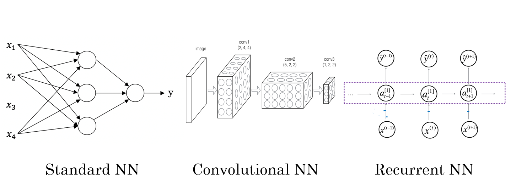

# AndrewNg-DL-Course1-Week1

1. Week 1 :    Introduction
2. Week 2 :    Basics of Neural Network programming 神经网络编程框架
3. Week 3 :    One hidden layer Neural Networks 单隐层神经网络
4. Week 4 :    Deep Neural Networks 多层神经网络

## 1.1 WHAT IS NEURAL NETWORKS

#### 神经网络里面的神经元

由图可得，通过==神经元==可以从输入x到输出y。

## 1.2 Supervised Leaning in Neural Network

用神经网络进行监督学习

### NN types

Different NN types are used for different problems:

### Structured Data and Unstructured Data

| Structured Data                                | Unstructured Data                         |
| ---------------------------------------------- | ----------------------------------------- |
| database                                       | audio/image/text                          |
| each feature/column has a well-defined meaning | no well-defined meaning for pixels/tokens |
| 表格型数据                                     | 一些抽象的数据（音频，图像，文本）        |

## 1.3  Why is deep learing taking off

- 讨论深度学习崛起别后的一些主要驱动因素

- 传统学习算法
  - 支持向量机 support vector machine
  - 逻辑回归 logistic regression

### Scale drives deep learning progress

- 在小训练集阶段
  - 各种算法（NN or 传统算法） 之间的相对顺序并不是很明确
  - 性能取决于人的skill at hand engineering features
  - ✅有人训练的一个SVM表现得比一个大型神经网络更好
- 在大训练集阶段
  - 大型的神经网络占主导地位 dominate the other approaches

### computation faster

### new algorithms

e.g. from sigmoid to ReLU, which in turn speeds up computation too

## 1.4 Test

> 1. What does the analogy "Al is the new electricity" refer to?
>
> - Similar to electricity starting about 100 years ago, Al is transforming multiple industries.
>
> - Al is powering personal devices in our homes and offices, similar to electricity.
>
> - Through the "smart grid"【智能电网】, Al is delivering a new wave of electricity.
>
> - Al runs on computers and is thus powered by electricity, but it is letting computers do things not possible before.

请注意: 吴恩达在视频中表达了同样的观点。

A

> 2. Which of these are reasons for Deep Learning recently taking off? (Check the three options that apply.)
>
> - We have access to a lot more computational【计算的】 power.
>
> - Deep learning has resulted in significant improvements in important applications such as online advertising, speech recognition, and image recognition. 
>
> - Neural Networks are a brand new field.
>
> - We have access to a lot more data.

A D 三个答案？？

> 3. Recall this diagram of iterating over different ML ideas. Which of the statements below are true? (Check all that apply.)
>
> 
>
> - Being able to try out ideas quickly allows deep learning engineers to iterate more quickly.
>
> - Faster computation can help speed up how long a team takes to iterate to a good idea.
>
> - It is faster to train on a big dataset than a small dataset.
>
> - Recent progress in deep learning algorithms has allowed us to train good models faster (even without changing the CPU/GPU hardware).

ABD

> 4. When an experienced deep learning engineer works on a new problem, they can usually use insight【洞察力】 from previous problems to train a good model on the first try, without needing to iterate multiple times through different models. True/False?
>
>    - True
>
>    - False

==B==

> Note:  Maybe some experience may help, but nobody can always find the best model or hyperparameters without iterations.(注：也许之前的一些经验可能会有所帮助，但没有人总是可以找到最佳模型或超参数而无需迭代多次。)

> 5. Which one of these plots represents a ReLU activation function?
>
> 
>
> 

> 6. Images for cat recognition is an example of “structured” data, because it is represented as a structured array in a computer. 
>
>    True/False?

False

> 7. A demographic【人口统计学】 dataset with statistics on different cities' population, GDP per capita, economic growth is an example of "unstructured" data because it contains data coming from different sources. 
>
>    True/False?

False

> 8. Why is an RNN (Recurrent【循环】 Neural Network) used for machine translation, say translating English to French? (Check all that apply.)
>
>    - ==It can be trained as a supervised learning problem.==
>
>    - It is strictly more powerful than a Convolutional Neural Network (CNN).
>
>    - It is applicable【使用的】 when the input/output is a sequence (e.g., a sequence of words).
>
>    - RNNs represent the recurrent process of Idea->Code->Experiment->idea

==A==C

> Note: ==RNN can be trained as a supervised learning problem.==

> 9. In this diagram which we hand-drew in lecture, what do the horizontal axis (x-axis) and vertical axis (y-axis) represent?
>
> 

- x-axis is the amount of data
- y-axis (vertical axis) is the performance of the

> 10. Assuming the trends described in the previous question's figure are accurate (and hoping you got the axis labels right), which of the following are true? (Check all that apply.)
>
> - Decreasing the size of a neural network generally does not hurt an algorithm's performance, and it may help significantly.
>
> - Increasing the training set size generally does not hurt an algorithm's performance, and it may help significantly.😄
>
> - Decreasing the training set size generally does not hurt an algorithm's performance, and it may help significantly.
>
> - Increasing the size of a neural network generally does not hurt an algorithm's performance, and it may help significantly.😄