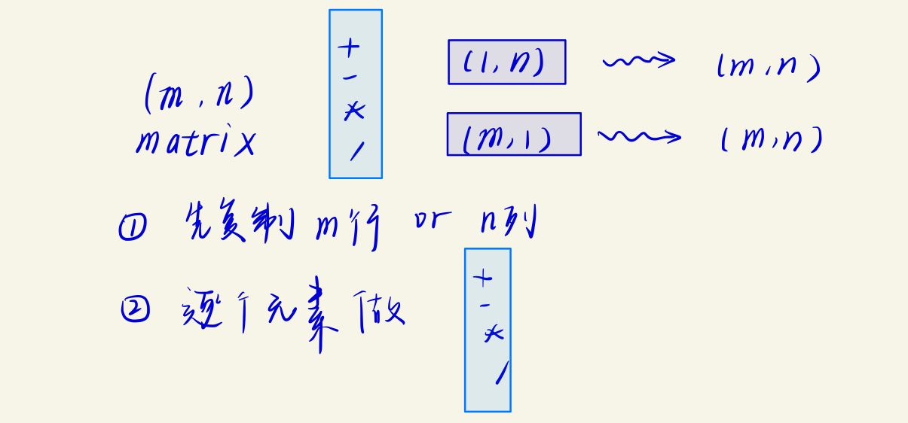
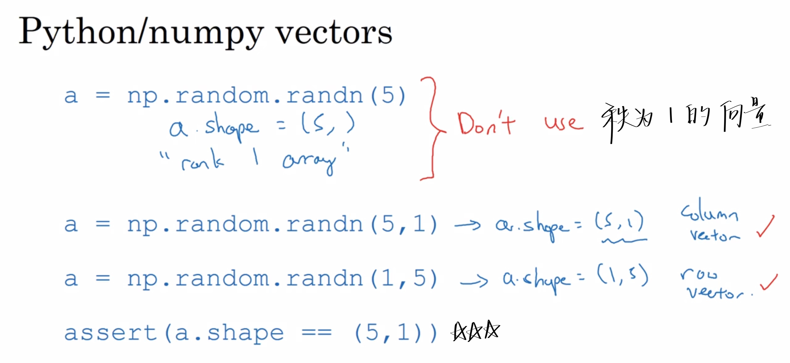

# Basics of Neural Network programming 

​																											神经网络编程的基础知识

## 2.1 Binary Classification

**Logistic regression** is an algorithm for binary classification.

In binary classification, our goal is to learn a **classifier**【分类器】.

- 构造神经网络时，用列向量堆叠，会让构建过程much easier

## 2.2 Logistic Regression

这是一个用在**输出y标签是0或1的监督学习问题**上的学习算法。

> 也就是二元分类问题


- 给出$X$， 我们想要获得$\hat{y} = P(y=1|x)$，即输出为$y$的概率。

$$
x \in \mathbb{R}^{n_{x}},且 \hat{y} \in [0,1]
$$

- 参数：

$$
w \in \mathbb{R}^{n_{x}}, b \in R
$$


- 输出：

因为$\hat{y} \in [0,1]$，所以才要==加上sigmod函数==。$w^{T}x + b$的取值范围太大了，是$(-\infty,+\infty)$
$$
\hat{y} = \sigma(w^{T}x + b), where \, \sigma(z) = \frac{1}{1+e^{-z}}
$$


- 目的：

不断地调整两个参数，使得==损失函数==最小。


## 2.3 Logistic Regression loss function and cost function 

```
!!! note
Lost function【损失函数】 是在单个训练样本中定义的，它衡量了在单个训练样本上的表现，是一个凸函数
Cost function【成本函数】 是针对所有训练样本的，它衡量了在全体训练样本上的表现，是一个凸函数
```


**成本函数被定义为平均值，即1/m 的损失函数之和**

> - 目标
>   - loss function 尽量的小
>     - 当标签y = 1，我们需要 $\hat{y}$尽量的大
>     - 当标签y = 0，我们需要 $\hat{y}$尽量的小
>     - 正好符合我们的直觉
>   - cost function 尽量的小

## 2.4 Gradient Descent

用梯度下降法去训练或学习训练集上的参数 $w$ 和 $b$

- 从初始点开始朝最陡的下坡方向走一步-------即梯度下降一步-------即迭代一次
  - $w := w - \alpha \frac{d J(w,b)}{dw}$
    - 代码：$w := w - \alpha dw$
  - $b := b - \alpha \frac{d J(w,b)}{db}$
    - 代码：$b := b - \alpha db$
  - $\alpha$是学习率，和更新的每一步的步长有关系
- 不断下降，很有希望收敛到全局最优解


## 2.5 Derivatives

```
!!! note
对微积分和导数有直观的理解
```

## 2.6 More derivatives examples

- The derivative of the function just means the slope of the function. The slope of the function can be different at different points on the function
- If you want to look up the derivative of a function, you can filp open your calculus textbook or look at the Wikipedia.

## 2.7 Computation Graph

神经网络计算是通过前向传播和后向传播过程来实现的。

我们先通过前向传播计算出神经网络的输出，

然后再通过后向传播计算出对应的梯度或导数。

## 2.8 Derivatives with a Computation Graph


- $d var$ means $\frac{dJ}{dvar}$
  - $da$ means $\frac{dJ}{da}$
  - 在代码中就写成dvar就可以了
- 一个后向传播计算的例子
  - 链式法则
  - $\frac{dJ}{du} = \frac{dJ}{dv} \frac{dJ}{du}$

## 2.9 Logistic Regression Gradient descent 逻辑回归的梯度下降法

怎么通过计算偏导数来实现logistic回归的梯度下降法

在本节视频中，使用导数流程图去就算梯度。

梯度下降法应用到logistic回归的一个训练样本上。


## 2.10 Gradient descent on $m$ examples

梯度下降法应用到logistic回归的==$m$==个训练样本上。


## 2.11 Vectorization

向量化是消除你的代码中显式for循环语句的艺术

the art of getting rid of explicit for loops in your code

### What is vectorization


```
!!! note
只要有其他可能（使用numpy内置函数），就不要使用显式for循环
Whenever possible, avoid explicit for-loops.
```

## 2.12 More vectorization examples

- dot
  - $ U = np. dot(A,v)$
  - 
- exp
  - $ U = np. exp(v)$
- log
  - $ U = np. log(v)$
- abs
  - $ U = np. abs(v)$
- maximun
  - $ U = np. maximun(v,0)$
  - 求出V中所有元素和0之间相比的最大值
- square
  - $ U = V**2$
  - V中每个元素的平方
- Logistic regression derivatives
  - 把2个for循环变成一个了
  - 

## 2.13 Vectorizing Logistic Regression


```
Z = np.dot(w.T,X) + b
# b 本来是一个（1，1）的矩阵，也就是一个实数
# 但是通过广播机制，会扩展成一个（1，m）的行向量
```

## 2.14 Vectorizing Logistic Regression's Gradient Computaion 向量化逻辑回归的梯度输出

- 一次迭代

  - 前向传播
    - 计算出$z$和$a$

  - 反向传播
    - 计算出$da$和$dz$
      - $da=-\frac{y}{b}+\frac{1-y}{1-a}$
      - $dz = a -y$
    - 计算出$dw$和$db$
      - $dw = xdz$
      - $db = dz$
  - 更新
    - 更新$w$和$b$

  > 注意⚠️
  >
  > 这里取$x$有两个特征$x_{1}$和$x_{2}$，分别有两个权重参数$w_{1}$和$w_{2}$


## 2.15 Broadcasting in Python

注意只有按元素运算能广播，矩阵乘法维度不一样会直接报错！

更多，在numpy文档中搜索broadcasting



## 2.16 A note on py/numpy ectors



## 2.17 Quick tour of Jupyter/ python notebooks

## 2.18 Explanation of logistic regression cost function(Optional)

> 说明logistic回归成本函数的表达式为什么是这样的
>
> for why we like to use that cost function for logitic regression

