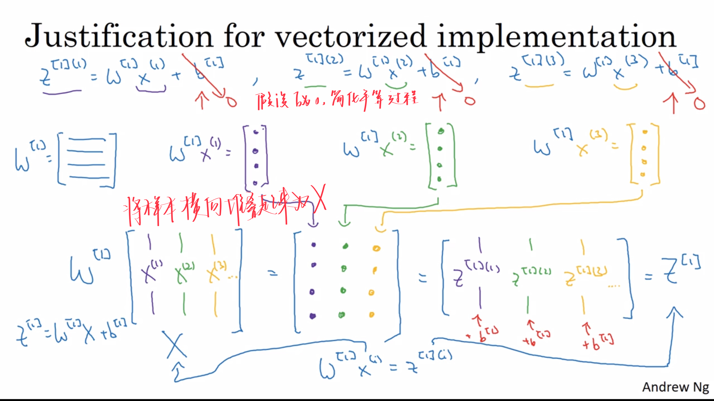

# One hidden layer Neural Networks 单隐层神经网络

## 3.1 Neural Networks Overview

| notation  | meaning                              |
| :-------: | ------------------------------------ |
| 上标$[i]$ | 神经网络中的第$i$层（第0层为输入层） |
| 上标${i}$ | 表示第$i$个训练样本                  |

## 3.2 Neural Network Representation 神经网络的表示

- 隐藏层
  - 输入和输入都看不见
- 输入的表示
  - 原来使用$x$表示$[x_{1},x_{2},x_{3},x_{4}]^T$
  - 现在也可以使用$a^{[0]} = x$
    - $a$表示activate
- 层的表示
  - 每一个层都会输出一个“激活值”
  - 所以可以表示成$a^{[i]}$
  - 其中$a_{j}^{[i]}$，表示为第$i$层，第$j$个神经元（结点，单元）
  - 且$a^{[1]} = [a_{1}^{[1]},a_{2}^{[1]},a_{3}^{[1]},a_{4}^{[1]}]^T$，（假设第1层里面有四个单元）
- 层数的计算
  - 当命名一个神经网络的时候，我们不算入输入层（第0层），所以隐藏层是第一层
  - 字面上，这是一个“三层的“神经网络
  - 但实际上，称为双层神经网络
- 参数
  - $w^{[g]}$是一个$e \times f$的向量， 其中$e$是当前层（第g层）中含有的单元数，$f$是上一层（第g-1层）中含有的单元数（f个输入特征）
  - $b^{[g]}$是一个$e \times 1$的向量， 其中$e$是当前层（第g层）中含有的单元数

## 3.3 Computing a Neural Network's Output

重复很多次Logistic那样的运算过程

- 一个计算单元
  - 

- 一个神经网络
  - 

## 3.4 Vectorizing across multiple examples 多个样本的向量化

将训练样本横向堆叠起来构成矩阵$X$

## 3.5  Explanation for vectorized implementation

手算证明向量化是可行的，“合法的”。

## 3.6 Activation functions

- 不同层的激活函数可以不一样
  - 在激活函数上面加上$[i]$表示这是第$i$层的激活函数

| 函数                                                         | 优点                                                    | 缺点                                                         | 图像                                                         | 特点                                    |
| ------------------------------------------------------------ | ------------------------------------------------------- | ------------------------------------------------------------ | ------------------------------------------------------------ | --------------------------------------- |
| $a=\sigma (z) = \frac{1}{1+e^{-z}}$                          | 用于 二元分类问题中 作为输出层的激活函数           | 在$z$很大很大或很小很小的时候， 导数的梯度（函数的斜率）趋近于0, 拖慢梯度下降算法 |  |                                         |
| $ a =tanh(z) = \frac{e^{z}-e^{-z}}{e^{z}+e^{-z}}$            | 比sigma更好                                             | 在$z$很大很大或很小很小的时候， 导数的梯度（函数的斜率）趋近于0， 拖慢梯度下降算法 |  | 是由sigma函数变换而来的                 |
| 修正线性单元  rectified linear unit(ReLU) $a = max(0,z)$ | - ==激活函数的默认选择== - 没有函数斜率接近0的时候 |                                                              |  | 可以在$z=0$处给导数赋值，尽管此处不可微 |
| Leaky ReLU $a = max(0.01z,z)$                           | - 没有函数斜率接近0的时候                               |                                                              |  |                                         |

## 3.7 Why do you need non-linear activation functions?

- 如果使用线性激活函数------------$g(z)=z$
  - 神经网络只是把输入进行线性组合后再输出
  - 这样的话隐藏层变得毫无意义
  - 无论多少层，都是可以看成一层线性激活层
- 只有一种情况可以使用
  - 回归问题中的输出层（隐藏层中不可以）
    - 例如预测房地产价格
    - 但其实价格是永远非负数，ReLU函数更加适合

> 隐层的作用就是看激活函数的值是否达到了阈值，达到了才输出，否则就是0，这是为了去掉某些不重要的样本特征，防止出现过拟合导致模型能力低，，同时也是除去一些干扰特征

## 3.8 Derivatives of activation functions

| 函数                                              | 图像                                                         | 导数                                                   |
| ------------------------------------------------- | ------------------------------------------------------------ | ------------------------------------------------------ |
| $a=\sigma (z) = \frac{1}{1+e^{-z}}$               |  | $g'(z)=a(1-a)$                                         |
| $ a =tanh(z) = \frac{e^{z}-e^{-z}}{e^{z}+e^{-z}}$ |  | $g'(z)=1-(tanh(z))^{2}=1-a^{2}$                        |
| (ReLU) $a = max(0,z)$                        |  | $ g'(z)=\begin{cases}0 & z<0 \\1 & z>0 \end{cases}$    |
| Leaky ReLU $a = max(0.01z,z)$                |  | $ g'(z)=\begin{cases}0.01 & z<0 \\1 & z>0 \end{cases}$ |

## 3.9 Gradient descent for neural networks 神经网络的梯度下降法

## 3.10 Backpropagation intuition(Optional)

不会

## 3.11 Random Initialization

- 如果w为0，神经网络的计算变得没有意义
  - 出现对称性问题。
- 为什么使用常数0.01
  - w太大--->z太大--->激活函数的导数趋于0，激活函数饱和

