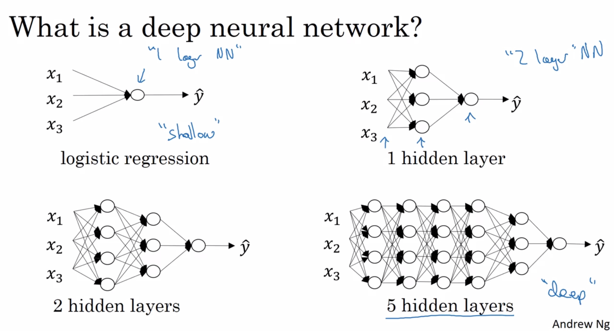
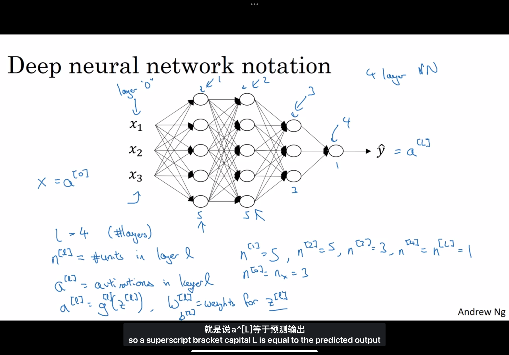
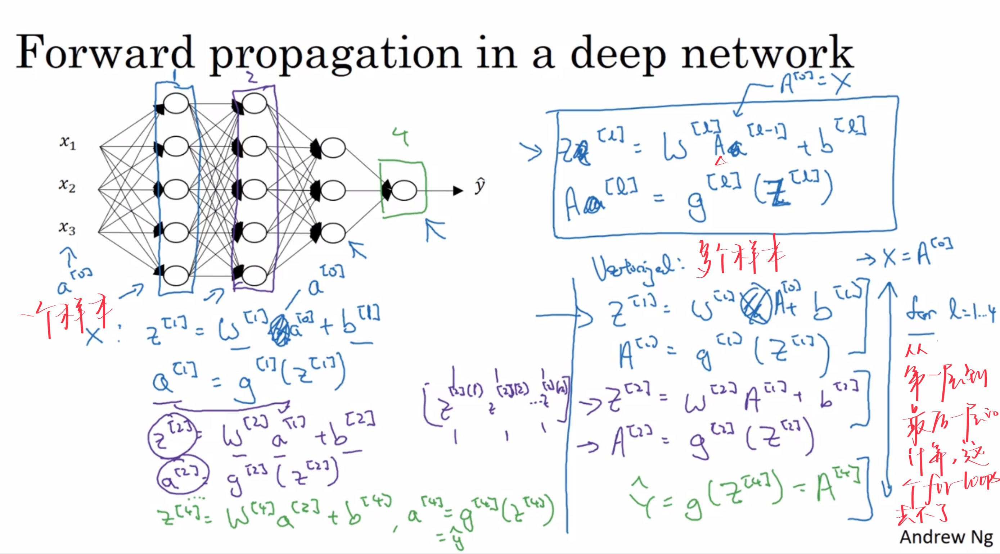
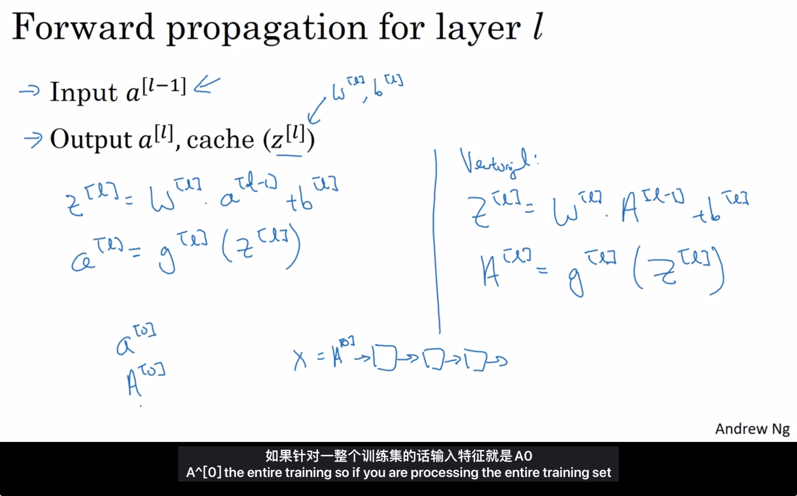
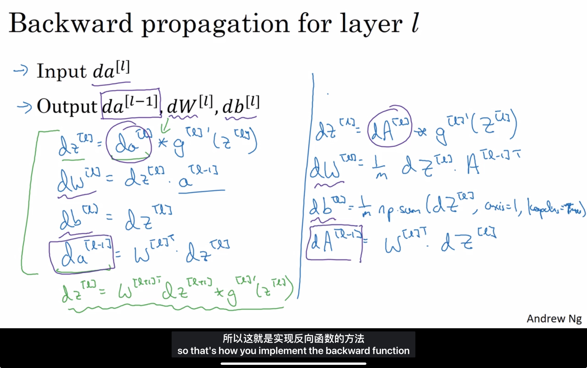
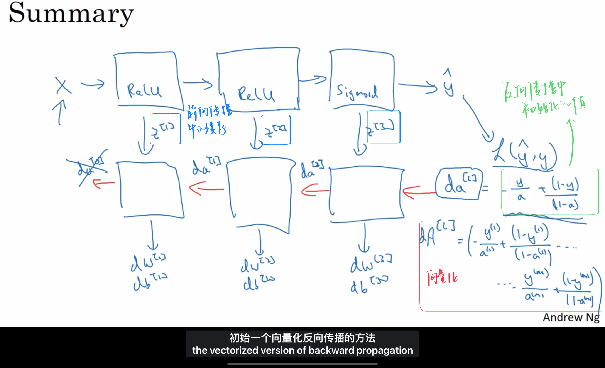

# Deep Neural Networks 多层神经网络

## 4.1 DeepL-layer Neural network

### What is a deep neural network

上图，展示了shallow和deep的区别

> 注意⚠️：计算层数时，不算入输入层

### Deep neural network notation

|          notation          |                   meaning                    |
| :------------------------: | :------------------------------------------: |
|            $L$             |         该神经网络中的层数(#layers)          |
|         $n^{[l]}$          |   第$l$层中的单元数(# units in layer $l$)    |
| $a^{[l]}=g^{[l]}(z^{[l]})$ | 第$l$层中的激活函数(activation in layer $l$) |
|         $w^{[l]}$          |              第$l$层中的参数$w$              |
|         $b^{[l]}$          |              第$l$层中的参数$b$              |

## 4.2 Forward Propagation in a Deep Network

深层网络中的前向传播

## 4.3 Getting your matrix dimensions right

核对矩阵的维数

如果你想做深度神经网络的反向传播，在你写代码的时候，一定要确认所有的矩阵维度是前后一致的。

>  不用强行记忆，你只要理解该层有多少个神经单元，我们就建多少行，然后每个神经单元都要连到上一层的所有神经单元，所以就会有上一层的神经单元数这么多列

### Parameters $W^{[l]}$ and $b^{[l]}$ 

### Vectorized implementation

## 4.4 Why deep representations?

为什么使用深度表示

- 简单到复杂

## 4.5 Building blocks of deep neural networks 

搭建深层神经网络块

为什么缓存z

## 4.6 Forward and backward propagation

多层感知机（MLP）是一种深层神经网络（DNN）

矩阵乘法自带求和，dw每个元素都是两个m维向量的内积，所以除以m

### ➣  Forward propagation for layer $l$

### ➣ Backward propagation for layer $l$

> 右侧是向量化的表达

### Summary

## 4.7 Parameters vs Hypperparameters

参数 VS 超参数

|                       hyperparameters                        |  parameters  |
| :----------------------------------------------------------: | :----------: |
| learning rate $\alpha$  #iterations #hidden layers $L$ #hidden units $n^{[1]},n^{[2]}$ choice of activation function momentum mini batch size regularization parameters... | $W$ $b$ |

因为超参数决定着最后参数W和b的值，所以被称作超参数。

超参数：控制实际参数的参数

## 4.8 What does this have to do with the brain?

为什么说深度学习和人类大脑相关

