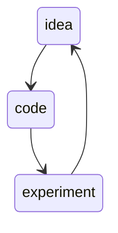
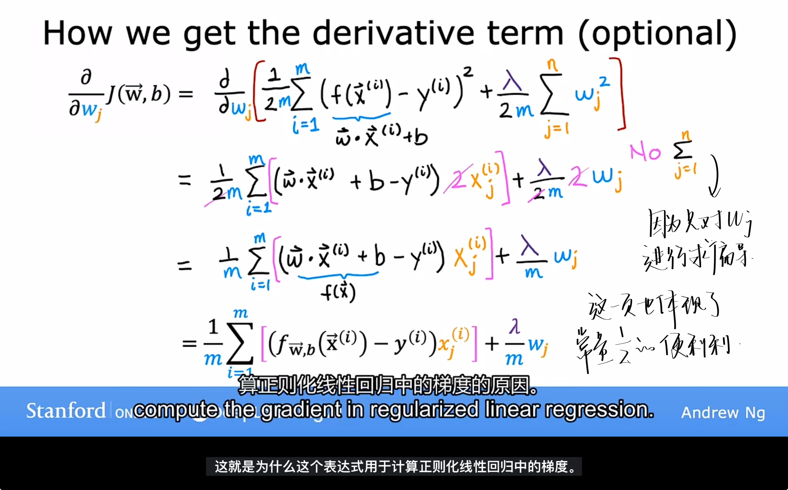
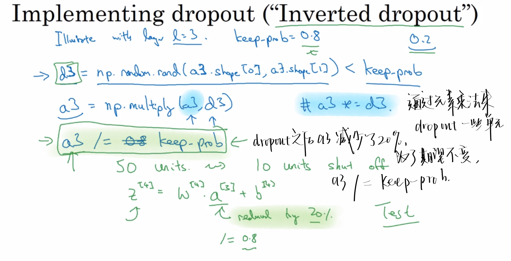
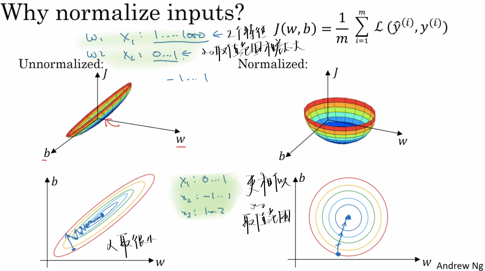
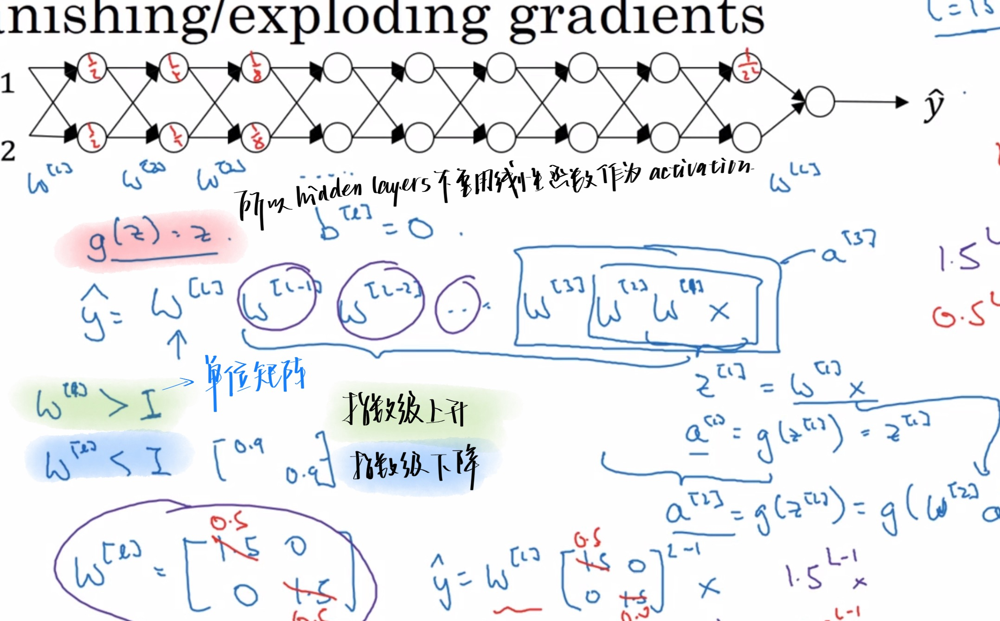
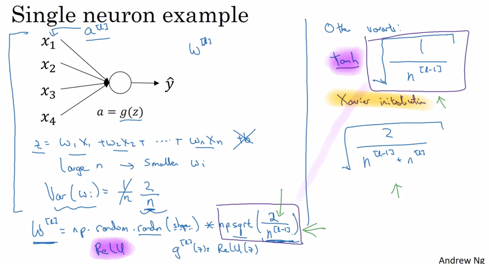
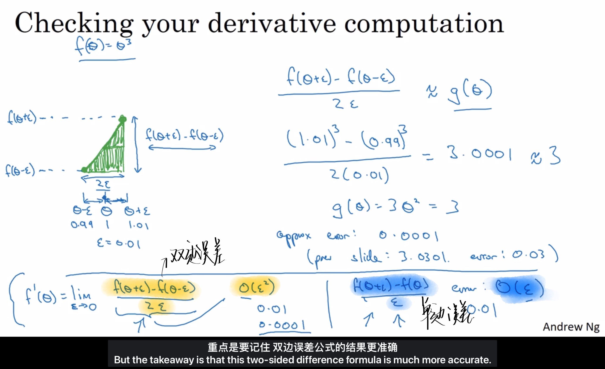
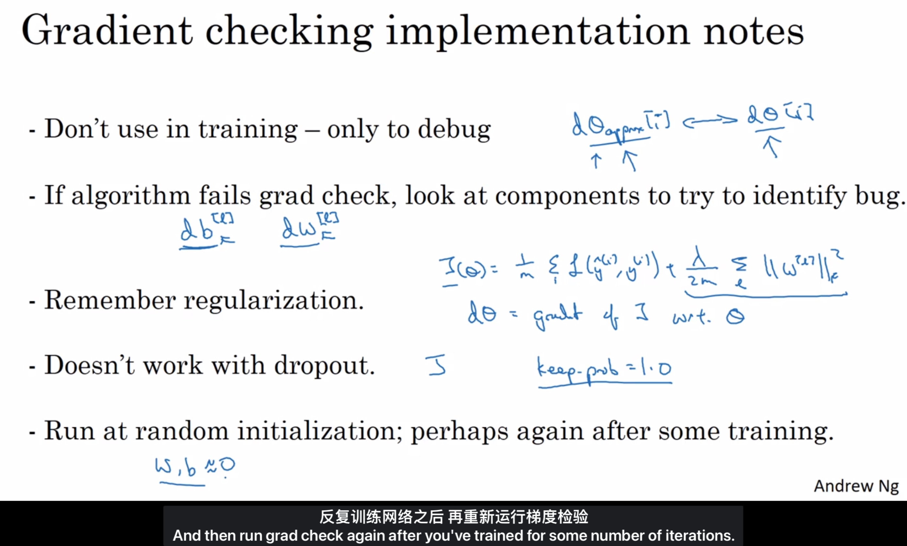

# AndrewNg-DL-Course2-Week1

Improving Deep Neural Networks: Hyperparameter tuning, Regularization and Optimization 超参数调整、正则化、优化算法

## 1.1 Train/dev/test sets 训练集/验证集/测试集

学习如何有效运作神经网络

### Applied ML is a highly iterative process

应用型机器学习是一个高度迭代的过程。

| hold-out cross validation set/dev set | 简单交叉验证集/验证集 |
| ------------------------------------- | --------------------- |
|                                       |                       |

- train/dev/test sets
  - 小数据量时代(100-1000-10000)
    - 7:0:3
    - 6:2:2
  - 大数据时代(1,000,000百万级别)
    - 验证集和测试集占数据总量的比例会趋向于变得更小
      - 因为验证集的目的就是验证不同的算法
      - 因为测试集的目的是正确评估分类器的性能
    - 98 : 1 : 1
    - 99.5 : 0.25 : 0.25
    - 99.5 : 0.4 : 0.1

### Mismatched train/test distribution

> [!NOTE]
>
> 要保证在训练和测试集分布匹配的情况下训练，这样机器学习算法会变得更快

## 1.2 Bias/Variance 偏差/方差

- under-fitting
  - high bias【这条直线不能很好地拟合数据】, low variance
- overfitting
  - Low bias, high variance【数据过度拟合】
- Just right
  - generalization泛化
    - 即使算法在它以前从未见过的全新事例上也能做出良好的预测

> 高偏差 under-fitting
>
> 高方差 over-fitting

- 假设：基本误差很小，训练集和验证集数据来自相同分布
  - Train set error ：判断方差是否过高
    - 方差关于数据问题
    - high variance
    - low variance
  - Dev set error ：判断偏差是否过高（和Train set error相差多不多）
    - 偏差关于模型问题
    - high bias模型泛化能力差，要换数据集
    - low bias
  - Optional（Basic）error ：上面两者都是基于此的相对概念
    - 基本误差都是15%的时候，Train set error 是16%已经是low variance了

### High bias and high variance

​																			⬆️上图就是High bias and high variance

- High bias
  - 几乎是一个线性分类器，并未拟合数据，不像图[Appropirate-fitting]
- HIgh variance
  - 曲线的灵活性太高了，拟合了两个错误样本

## 1.3 Basisc "recipe" for machine learning

- unfitting
  - high bias, low variance
- overfitting
  - Low bias, high variance

## 1.4 Regularization正则化

> 工作原理：
>
> 在每次迭代中缩小参数$w$一点点，然后进行正常的更新操作。

### 解决=="over-fitting"(high variance)==的问题

- get more train data
- select features to include/exclude 
  - 选择一些特征，丢弃一些特征
- Reduce size of parameters -----"Regularization"
  - 鼓励学习算法缩小一些特征的参数值，而不必要求其参数为0（即丢弃）
    - 只对$w$作缩小，$b$不作
  - 保留所有的特征，但防止特征产生多大的影响，避免导致过度拟合

> 是当我们在不知道哪个特征是重要的或者不重要的时候，我们无法对特征根据不重要性进行删除，这时应该使用正则化.
>
> 而对于我们可以自主判断出哪些是不重要的特征，我们当然可以选择直接去除那些不重要的特征（方法二）

### How does it works in LOGISTIC REGRESSION

- Sparse 稀疏的

  - L1造成稀疏化的原因是因为这实际上是一个在L1条件下的最优化问题，得出来的解矩阵往往是稀疏矩阵

  - L1正则化在0处不可导，梯度会跳变；w较小就会被置0。

- 超参数$\lambda $

  - 正则化参数
  - 使用验证集或交叉验证来配置这个超参数$\lambda $

  - 代码中用$lambd$表示$\lambda $，以免和python中的保留字段冲突
  - 选择它的值

  

  - 导数
    - 

### How does it works in NEURAL NETWORK

- Frobenius norm 弗罗贝尼乌斯范数
  - 表示一个矩阵中所有元素的平方和
- weight decay
  - 权重衰减
  - L2正则化有时候也被叫做权重衰减
  - 因为权重指标w在更新的时候✖️了一个小于1的系数$(1-\frac{\alpha\lambda}{m})$
- back propagation

## 1.5 Why regularization reduces overfitting

为什么正则化可以减少方差问题

- 添加正则项后可以避免(penalizes)权值矩阵(weight matrices也就是Frobenius norm)过大
  - 相当于把一个神经网络简化为一个很小的网络，小到如同一个逻辑回归单元，但是深度很大
  - 把一些隐藏单元的作用弱化了

## 1.6 Dropout regularization正则化方法之一

Dropout【随机失活】

### How does it work ?

通过概率消除一些隐藏单元，

最后得到一个节点更少，规模更小的网络

然后使用back propagation方法进行训练

#####  "Inverted dropout"

【反向随机失活】通过除以keep-prob确保a3的期望值不变。

- ==keep-prob==
  - 具体的数字
  - 表示保留某个隐藏单元的概率
  - 每一层有自己的keep-prob
    - #unit越多，keep-prob一般越小
    - 也可以整个网络只有一个keep-prob值，要么drop-out要么不

这里d3是一个随机生成的矩阵，表示第三层输出中，由一堆true和false组成。

这表示将输出矩阵的某些部位设为false，也就是抹除掉，也就达到了前面dropout的目的

这里的对比是通过**元素乘法**实现的。

> python会把true和false翻译成0和1.

### Making predictions at test time

测试和预测不dropout，且不用除以那个dropout系数

## 1.7 Understanding Dropout

### Why does it work?

- 用一个更小的神经网络和正则化的作用很像
- 输出不能依靠任何特征，因为任何特征都有可能被随机清除，不愿意给任何输入加上太多的权重

## 1.8 Other Regularization methods

### 1️⃣Data augmentation 增加数据

生成假训练数据

- 水平翻转图片
- 随意裁剪图片
- 对数字进行一些轻微的变形

### 2️⃣Early stopping

提早停止训练网络

- 优点：只进行了一次梯度下降，不用尝试那么多的$\lambda$值

- 缺点：停止的时候代价函数J的值可能还不够小

最好的办法是用2种不同的方式来解决这两个问题

- 优化代价函数J
- 防止过拟合

## 1.9 Normalizing inputs

加速训练神经网络的方法：==归一化输入==

- Step 1️⃣：零均值化
  - $\mu = \frac{1}{m}\sum_{1}^{m}x^{(i)} \qquad x:=x-\mu$
  - 移动训练集，直到训练集的均值为0
-  Step 2️⃣：归一化方差
  - $\sigma = \frac{1}{m}\sum_{1}^{m}x^{(i)}**2 \qquad x/=x-\sigma^{2}$
  - 使得每个特征的方差都为1

> 📌练集和测试的的归一化应当相同
>
> - 训练集是怎么调整特征的，测试集也应当用同样的方法去调整特征

### Why

归一化是为了让每一个特征的取值范围相似。

如果特征值处于相似范围内，归一化处理就不是很必要了。

> 🧐 但是由于归一化并不会有什么危害，所以吴恩达经常会做归一化处理

- 归一化前：
  - 梯度下降法可能需要多次迭代过程，因为学习率$\alpha$只能取一个很小的值

- 归一化后：
  - 梯度下降法中可以使用较大的步长
  - 代价函数会更加的对称。

## 1.10 Vanishing/exploding gradients

- 梯度消失/梯度爆炸
  - 导数有时候特别小或特别大

## 1.11 Weight initialization for deep networks

神经网络的权重初始化: 不能比1大很多，也不能比1小很多。

这又是一个==加速训练神经网络==的小技巧。

不太懂的同学可以搜一下Xavier Initialization 和 He Initialization

### Single neuron example

设n表示神经元的输入特征数量，

$z = w_{1}x_{1}+...+w_{n}x_{n}$

n越大，$w_{i}$就越小。

所以$w_{i}$的初始值可以设置为$\frac{1}{n}$ or $\frac{2}{n}$(when the activation is ReLU)

> 不同的激活函数，w的初始值也有不同的计算公式。
>
> 对于同一个激活函数，也有不同的计算公式。

## 1.12 Numerical approximation of gradients

梯度的数值逼近

在propagation中，有一个叫gradients checking【梯度检验】的测试来确保反向传播的正确实施。

在了解这个测试之前，我们得先学习一下梯度的数值逼近。

### Checking your derivative computation

- 使用双边误差【 two sided difference 】的方法更逼近导数。
- 使用双边误差去判断别人给你的函数$g(\theta)$是否正确实现了函数f的偏导
- 检验我们的反向传播是否得以正确的实施（找bug）

## 1.13 Gradient Checking(Grad check)

简单解释就是你拿你做出的最优解代入算出近似梯度值，你函数有个理论值，判断是否相似来检查bug

就是之前求梯度是通过推出的公式，这里求梯度是通过邻近两个割点求近似值，如果这两个梯度值差不多的话，那么就说明我们之前做的是对的

## 1.14 Gradient Checking implementation notes

关于梯度检验实现的注意事项⚠️

