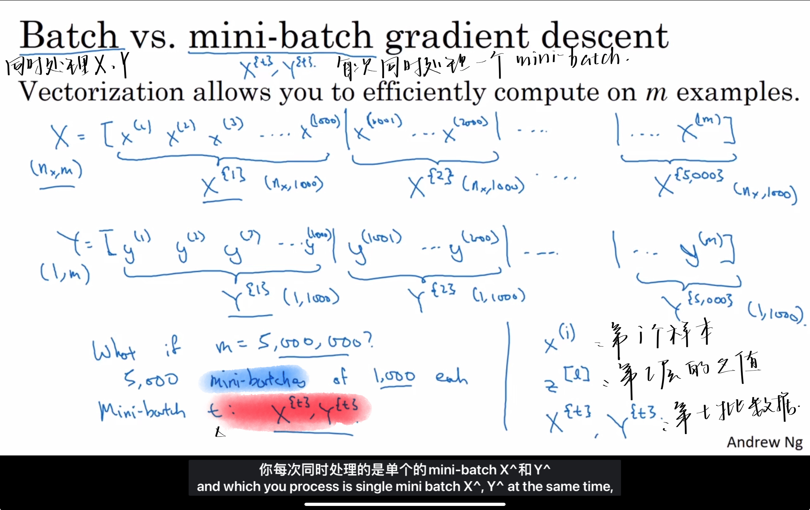
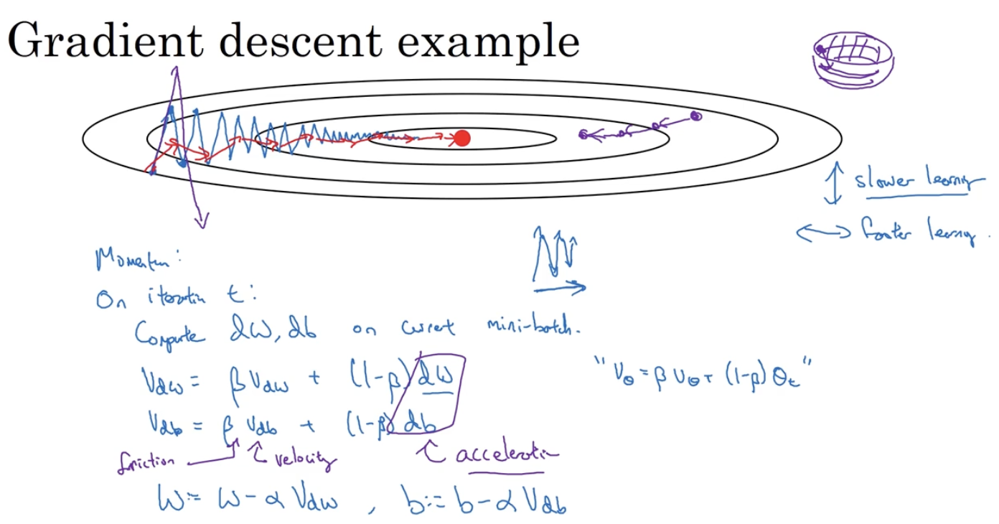
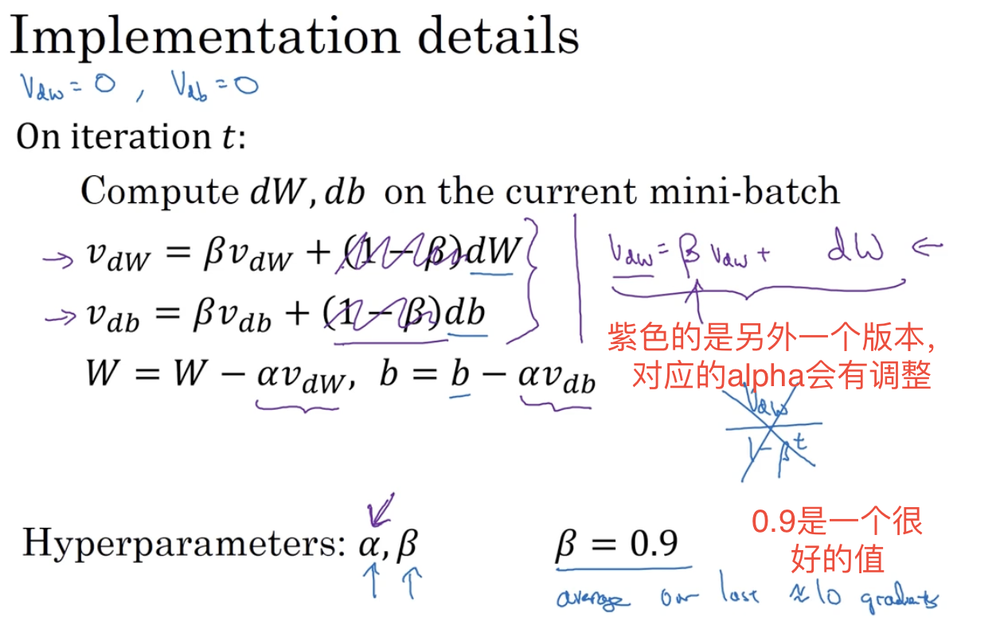
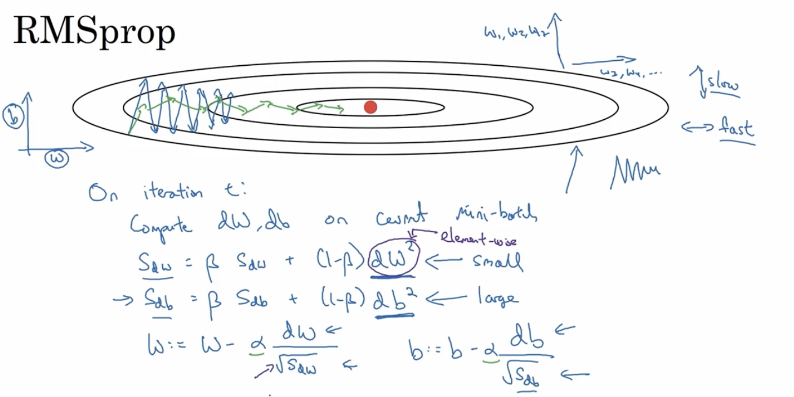
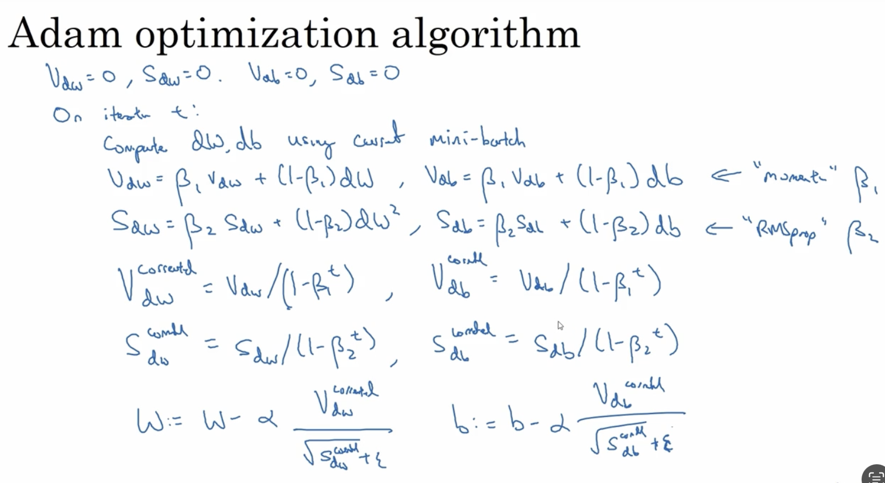

# AndrewNg-DL-Course2-Week2

Optimization Algorithms

## 2.1 Mini-batch 

梯度下降法

> 使用快速的优化算法能提高效率

### Mini-batch gradient descent

分治思想：分解、解决、合并

- 1 epoch 一代
  - 只遍历了一次训练集
- 使用mini-batch梯度下降法遍历一次训练集
  - 就是一代就能做5000【假设一个mini-batch里面有5000个样本】个梯度下降

- 分块梯度下降可以
  - 1】提升运行的速度
  - 2】一次遍历所有的样本集可以进行多次对w和b的迭代

## 2.2 Understanding mini-batch gradient descent

当mini-batch size=1的时候，这个算法叫做随机梯度下降【stochastic gradient descent】，会有很多的噪声【👆上图的紫色】，永远都不会收敛，一直在最小值附近波动。

应该选择一个不大不小的值(1<x<m)，这样学习效率最高【👆上图的绿色】

## 2.3 Exponentially weighted (moving) averages

计算指数加权平均数的关键方程：
$$
V_{t} = \beta v_{t-1} + (1-\beta)\theta_{t}
$$

## 2.4 Understangding exponentialy weighted averages

深入讨论算法的本质作用

### $\frac {1}{1-\beta}是怎么来的$

指数加权平均数的好处：

- 只占用极少的内存
  - 这样算平均数不是最精准的，但是
  - 不用保存所有的要拿去平均的数
- 只需要一行代码

## 2.5 Bias Correction in exponentialy weighted averages

初始阶段会有误差，但其实实践中很少关注这个误差。

但是如果关心初始阶段，就要注意这个误差。

## 2.6 Gradient descent with momentum

> 提出了$\beta$这个超参数

速度总是快于标准的梯度下降算法

计算梯度的指数加权平均数，利用该梯度更新你的权重。

如果平均这些梯度，你会发现这些纵轴上的摆动的平均值接近为0。

利用momentum这个梯度下降算法，我们希望横轴方向运动得更快，纵轴方向运动得更慢。

> 你有一个球，微分给了这个球一个加速度($dw,db$)，球正在往下滚，$\beta<1$表现出一点摩擦力，所以球不会无限加速下去。
>
> 你的球可以向下滚获得动量，不像之前一样每一步都独立于上一步

## 2.7 RMSprop

root mean square prop 均方根

将微分进行平方，最后使用平方根进行更新w和b

将RMSprop和Momentum结合起来

## 2.8 Adam optimization algorithm

将momentum和rmsprop结合在一起

## 2.9 Learning rate decay

speed up learning algorithm: 随时间慢慢减少学习率（学习率衰减）

注意，one epoch is one pass through the data

多了一个超参数 ：学习率

这个超参数也有多种调参的方法，有自动挡（两种公式计算方法）和手动挡（手动调）。

但是这个超参数并不是吴恩达会率先尝试的内容
