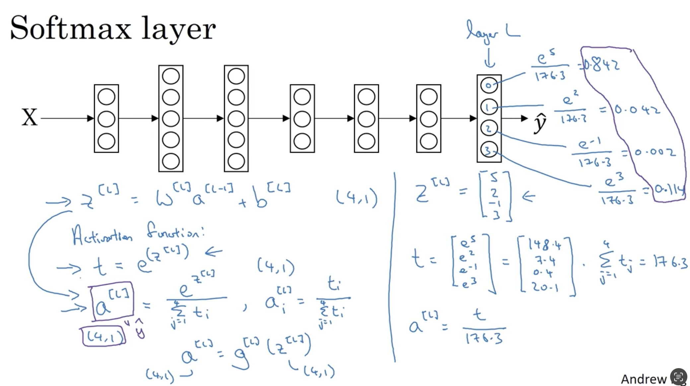
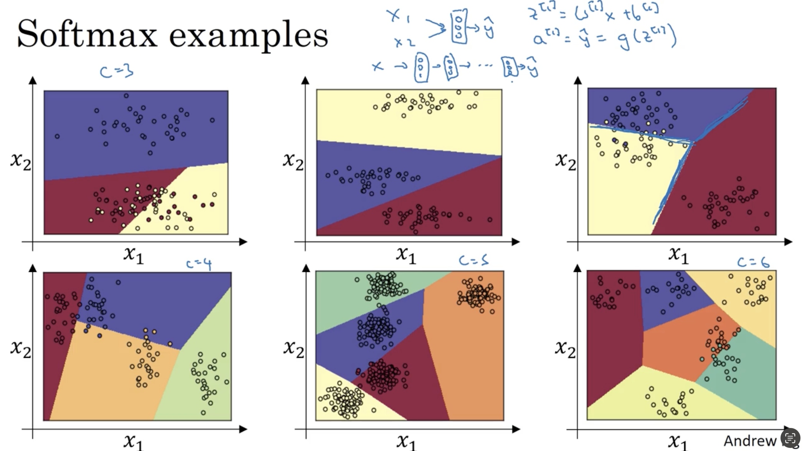
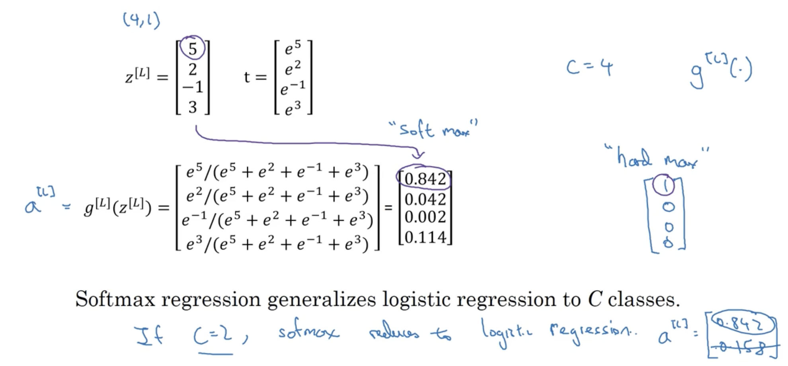
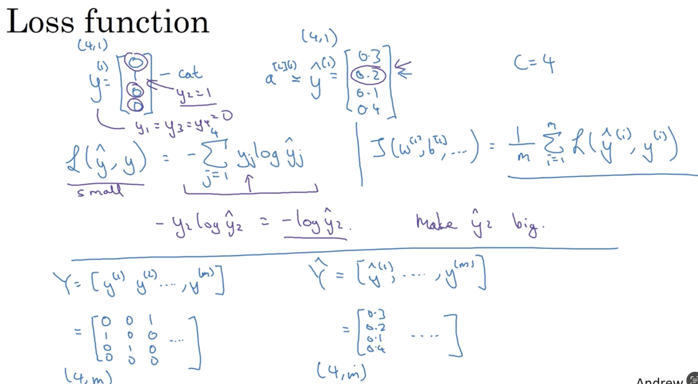
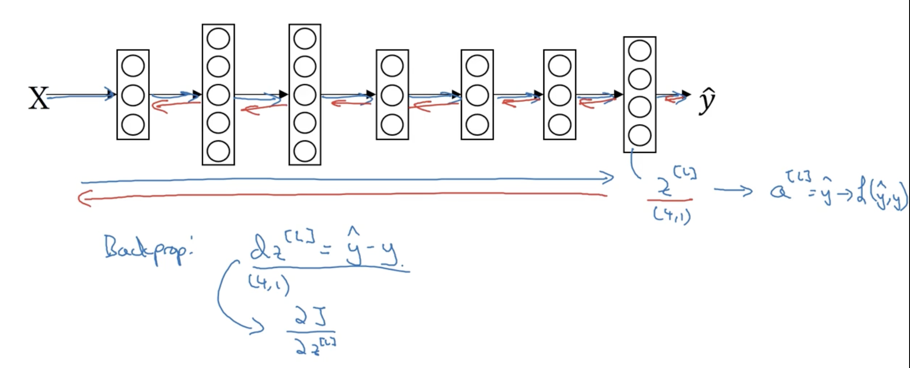

# AndrewNg-DL-Course2-Week3

## 3.1 Tuning process

难点：有很多的超参数

参数之间的重要性：

- $\alpha$是最重要的
- $\beta$(0.9), # hidden units , mini-batch size
- #layers, learning rate decay
- $\beta_{1}(0.9),\beta_{2}(0.999),$ 伊普斯龙$(10^{-8})$

### Try random values: Don't use a grid

### Coarse to fine

## 3.2 Using an appropriate scale（合适的比例） to pick hyper parameter

搜索最优参数：使用线性轴去进行随机均匀取值是不合理的！

给定一个范围，超参在这个范围的不同区间对算法的效果不尽相同，选参的原则就是给不同的效果找尽可能一样多的参数样本点。

为了做到这个原则，就要改变参数轴，不再是线性的，而是**对数轴**，起到放大局部区间的效果。

## 3.3 Hyperparameters tuning in practice: Pandas vs. Caviar

- Pandas: 熊猫方式——babysitting one model
  - 在训练过程中不断地观察并及时调参数以获得更优性能
  - 当然也可以“大号练废了，再练一个小号”，过一段时间之后再去babysit一个

- Caviar: 鱼子酱方式——training many models in parallel
  - 计算机资源很多，可以同时训练很多个模型，最后选择一个性能最优的模型即可

## 3.4 Normalizing activations in a network

正则化：Regularization，归一化：Normalization

Batch Normalization ——Batch归一化，会使你的参数搜索问题变得很容易

tilde

### Implementing Batch Norm

- 你也许不想隐藏单元值必须是平均值为0和方差为1
  - 参数$\gamma,\beta$可以帮助我们控制隐藏单元层的平均值和方差
  - 使隐藏单元值的均值和方差标准化

## 3.5 Fitting Batch Norm into a neural network

看看batch归一化how it fits into the training of a deep network

### Adding Batch Norm(BN) to a network

- Batch Norms（归一化）是发生在计算z和a之间的
- 实践中，我们不必操作这些所有的具体的细节

### Working with mini-batches

Batch归一化通常和训练集的mini-batch一起使用

- ⚠️，在mini-batch中增加任何常数（b）不会对最后有任何影响，因为加上的任何常数都将会被均值减法所抵消

### Implementing gradient descent using Batch Norm

## 3.6 Why does Batch Norm work?

### Learning on shifting input distribution

"Covariate shift"——这个啥shift就是，训练集和测试集不符合同一个分布

这边的例子就是，训练用的全是黑猫，验证用的全是花猫，那验证集的准确率肯定不高

这里吴师想表述的意思应该是：现在是左右两边相当于不同的x通过同一映射得到的y分布不同，而如果映射规则也会发生变化，情况就更加复杂

从图上看，标准正态分布曲线同一个y对应两个X，BN使得左右两边的数据都预测得很好，防止了Covarite shift问题，是这个意思吧

假设mini_batch（简记为MB）比较的小，那么每一个MB之间的样本分布差异可能很大，如果不使用BN，则容易出现权重参数的变化过大，原来学习到的东西会产生一些丢失，

### Why this is a problem with neural networks?

说白了就是前层参数的变化会影响后层，如果不归一化，影响就会越累积越大

消除w,b带来的shift。尽量只保留由特征值带来的波动

Ng的意思就是说，前面层的参数的更新变化会让a2激活值发生很大的波动，而BN就是让数据集中于一个地方，避免了波动太大导致下一层不好学习

### Batch Norm as regularization 

Batch Norm有轻微的正则化效果

batch norm 既有乘性噪声（除以标准差），又有加性噪声（减均值））

和dropout一样是因为他也会轻微的加一点噪声影响，噪声是因为他使用的不是所有数据集而是一部分来求z，所以方差和均值都不是整个样本例子的真实方差和均值而是一个minibatch的

归一化过程中，均值和方差的估计是不准确的，因此引入了噪声，但这噪声也实现了轻微正则化的效果，相当于弄巧成拙

## 3.7 Batch Norm at test time

测试时的BN

也就是说均值和方差是需要根据前面计算过的minibatch得到的均值和方差进行指数平均后得到

总结：

在训练的时候，$\mu ,\sigma^{2}$是在an entire minibatch 上面计算出来的。

但是在测试的时候，你需要去逐一处理样本。

在train的时候，我们每一个minibatch都会得到一个mean和variance，然后test的时候就用mean和variance的exponentially weighted average

## 3.8 Softmax regression

识别多种类

### Recognizing cats, dogs, and baby chicks

输出四个概率，四个概率的和为1

### Softmax layer

softmax激活函数的特殊之处在于：输入和输出都是一个向量。




### Softmax examples



线性是只有一层softmax的情况，把softmax作为深层神经网络的输出层就是非线性的了

## 3.9 Training a softmax classifier

### Understanding softmax

softmax这个名称的来源是与hardmax相对比的。

-  softmax所做的从z到最后结果（概率）的映射更为温和
- hardmax所做的映射就“hard”多了：哪个数最大就映射为1，其他为0



softmax回归将logistic回归推广到了两种分类以上。

Softmax regression generalizes logistic regression to C classes.

### Loss function 

> 怎么训练带有softmax输出层的神经网络

损失函数所做的就是：找到你的训练集中的真实类别，然后试图使该类别相应的概率尽可能的高

最大似然估计：什么样的参数和X结合能够是出现Y的概率达到最大



### Gradient descent with softmax

在有softmax输出层的时候，如何实现梯度下降法

编程框架会帮助我们搞定导数计算。



sigmoid的公式就是在C=2，z2=0的情况下，softmax的特殊情况。

## 3.10 Deep Learining frameworks


从零开始写一个网络全部靠自己实现并不现实

### Deep learning frameworks

- Caffe/caffe2
- cntk
- dl4j
- keras
- lasagne
- mxnet
- PaddlePaddle
- TensorFlow
- Theano
- Torch

Choosing deep learing frameworks

- ease of programming(development and deployment)
- Running speed
- truly open(open source with good governance【良好的管理】)

## 3.11  TensorFlow

- 使用tf.Variable来定义参数
- tf.add用两次的原因是：里面的tf.add是损失函数中的单项式相加；外面的tf.add是损失函数求和的操作
- Session.run(init)初始化全局变量
- session.run(w)评估变量
- placeholder是一个我之后会赋值的变量，这种方式便于把训练数据加入损失函数


```python
import numpy as np
import tensorflow as tf

foefficients = np.array([1],[-20],[25])

w = tf.Variable([0],dtype=tf.float32)
x = tf.placeholder(tf.float32, [3,1])

cost = x[0][0]*w**2 + x[1][0]*w + x[2][0] # (w-5)**2
train = tf.train.GradientDescentOptimizer(0.01).minimize(cost)
init = tf.global_variables_initializer()

session = tf.Session()
session.run(init)
print(session.run(w))

for i in range(1000):
	session.run(train, feed_dict={x:coefficients})
print(sesssion.run(w))
```

```python
# 13-15行可以替换成下面
with tf.Session() as session:
  session.run(init)
  print(session.run(w))
```


