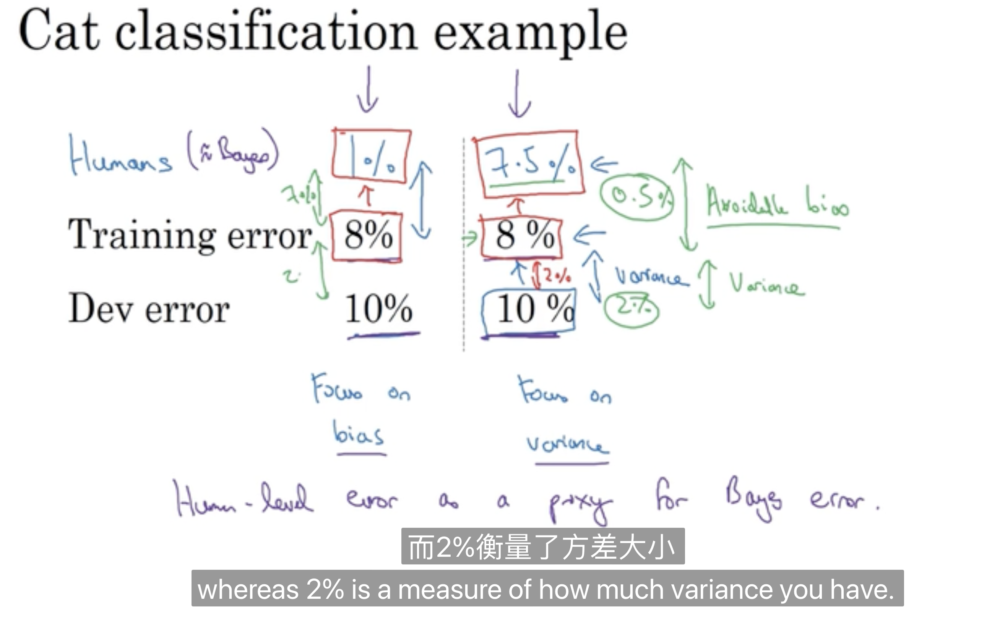
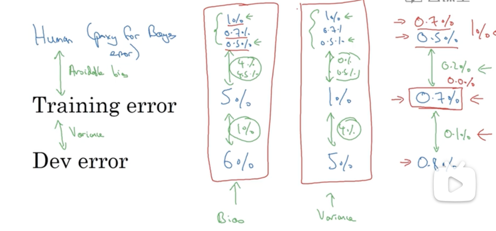
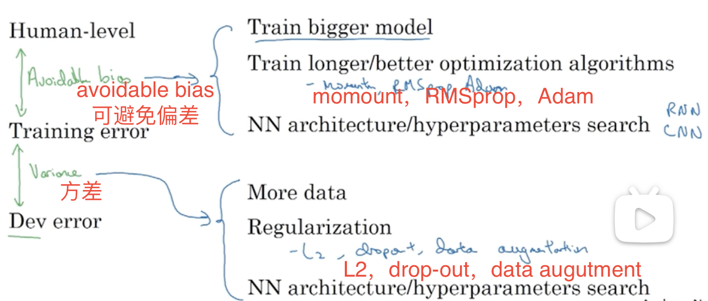

# AndrewNg-DL-Course3-Week1

---

Introduction to ==ML strategy==

## 1.1 Why ML strategy

## 1.2 Orthogonalization

正交化

### Chain of assumptions in ML

1. Fit training set well on cost function

2. Fit dev set well on cost function

3. Fit test set well on cost function

4. Performs well in real world

## 1.3 Single number evaluation metric

### 单一数值评估指标

- precision查准率P（图片集中被分辨为猫的概率）
- Recall查全率R（全是猫的图片集中分类器分辨为猫的概率）
  - 查准率和查全率是评判一个分类器的重要标准

> 但是通过两个参数去做评判是很麻烦的，两个参数合为一个参数会更好！

- F1分数（F1 score）
  - 结合查准率和查全率的标准方法
  - 正式：是P和R的调和平均数
  - 非正式：P和R的平均数

## 1.4 Satisficing and optimizing metrics

满足和优化指标

假如有N个metrics：

- 1个是optimizing ；只有一个metrics需要去尽可能地优化
- N-1个是satificing； 其他的metrics必须要达到一定的阀值（threshold）

---

Setting up your goal

##  1.5 Train/dev/test distributions

保持dev sets（开发集）和test sets（测试集）都来自同一分布！

> 💡Guideline❕
>
> Choose a dev set and test set to reflect data you expect to get in the future and consider important to do well on.

## 1.6 Size of dev and test sets

把大量数据分到训练集，然后少量数据分到开发集和测试集。

测试集的数量，==够用==就好。

## 1.7 When to change dev/test sets and metrics

原来的评估指标不足以去评估一个模型，就需要花时间定义一个新的评估指标

---

==Comparing to human-level performance==

## 1.8 Why human-level performance?

Bayes optimal error 贝叶斯最优错误率

## 1.9 Avoidable bias 可避免偏差

与human-level相比，去决定接下来要关注bias还是variance。

在计算机视觉任务重，可以用人类水平的错误率去估计或者代替贝叶斯错误率/贝叶斯最优错误率。

严格来说，人类水平的错误率比贝叶斯错误率要高一些，因为贝叶斯错误率是理论上的最优错误率。

## 1.10 Understanding human-level performance

### Human-level error as a proxy for Bayes error

### Error analysis example

## 1.11 Surpassing human-level performance

## 1.12 Improving your model performance

### The 2 fundamental assumptions of supervised learning

1. You can fit the training set pretty well(看成是你能做到可避免偏差很低)
2. The training set performance generalizes pretty well to the dev/test set(看成方差不大)

### Reducing (avoidable) bias and variance

