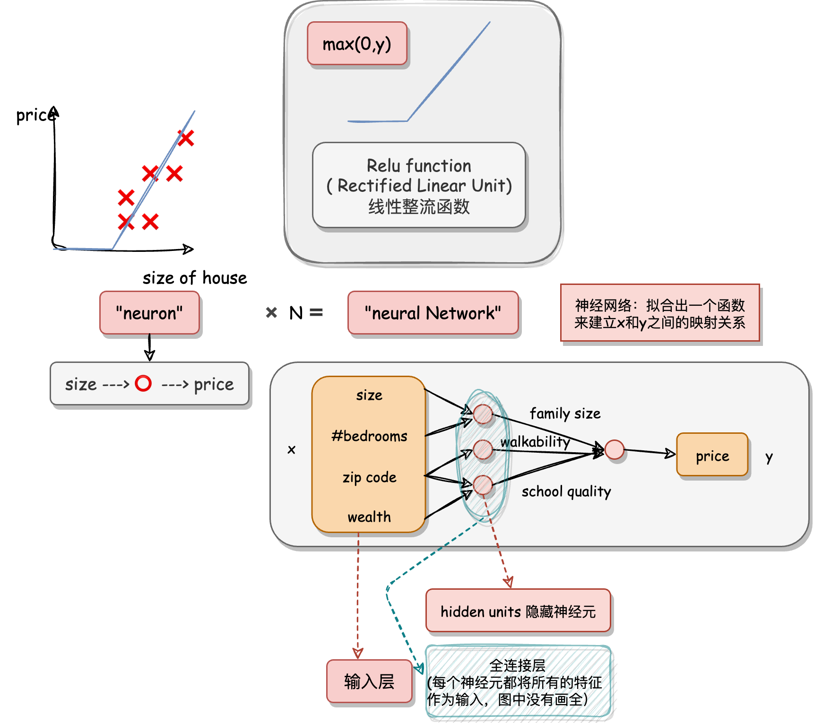
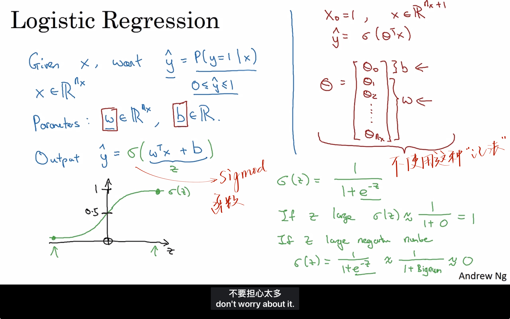
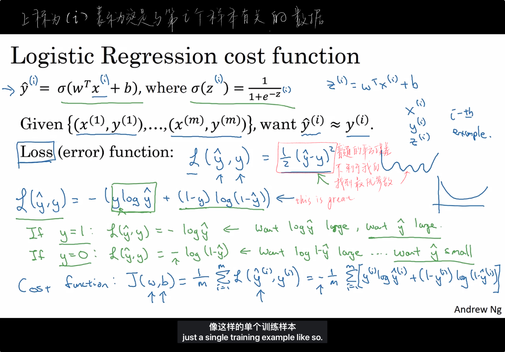
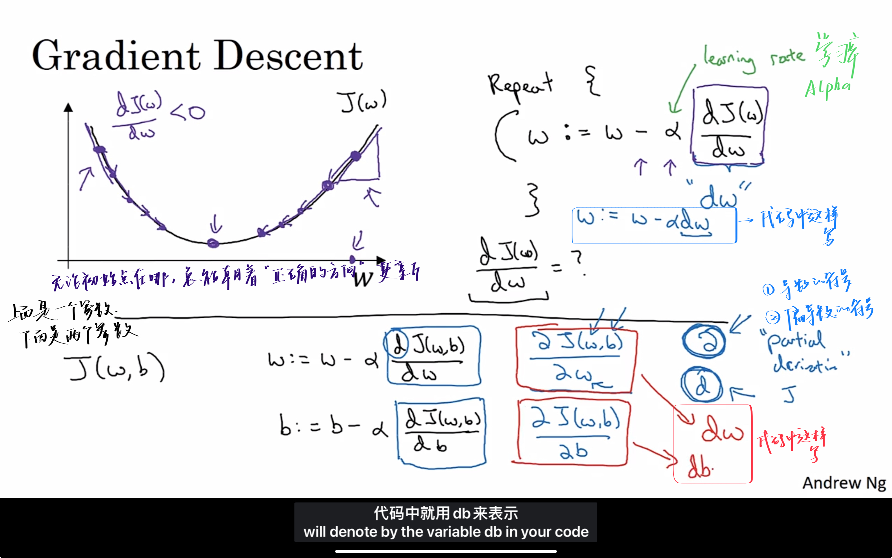
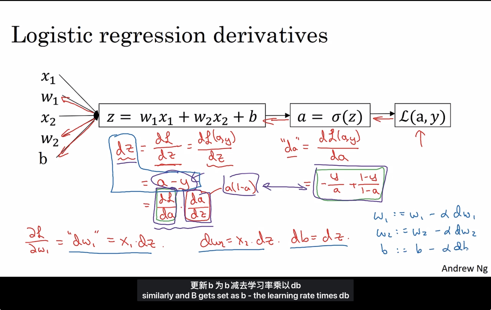
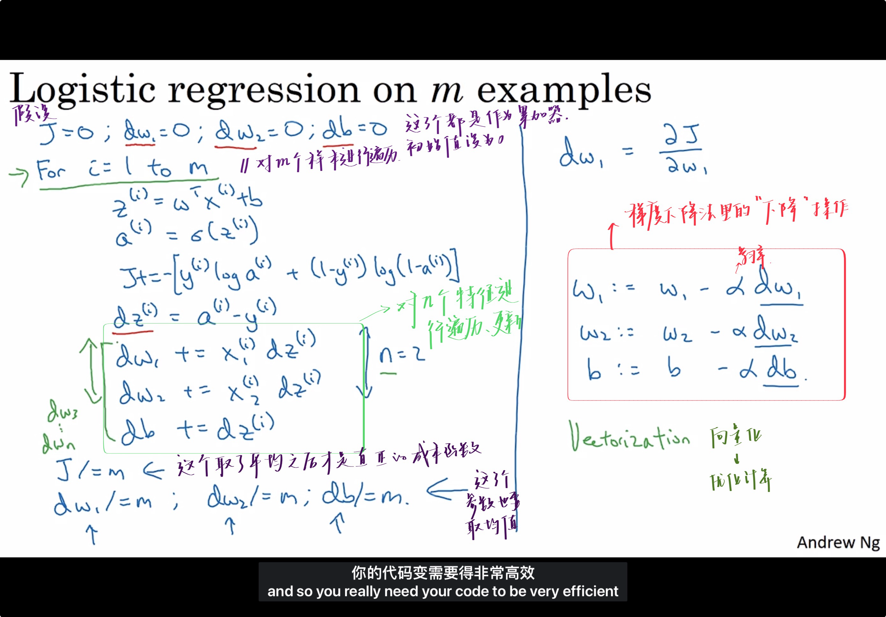
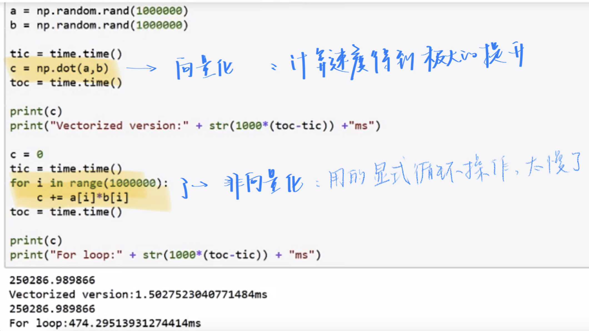
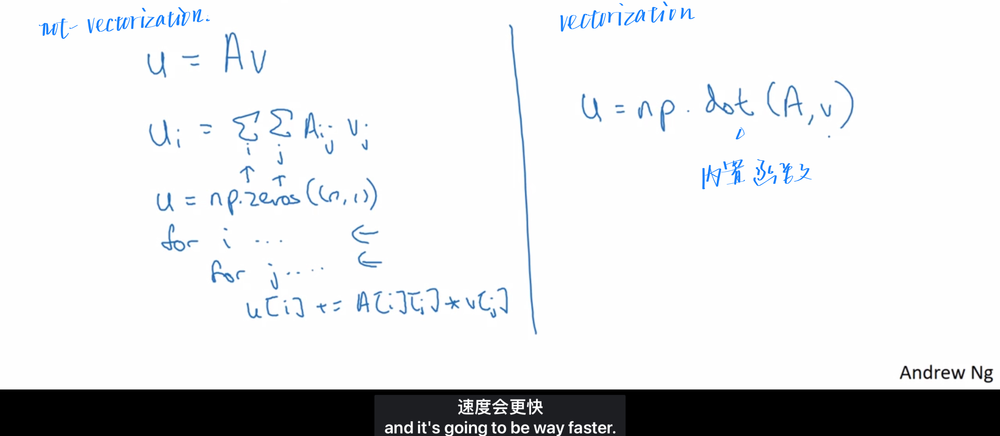
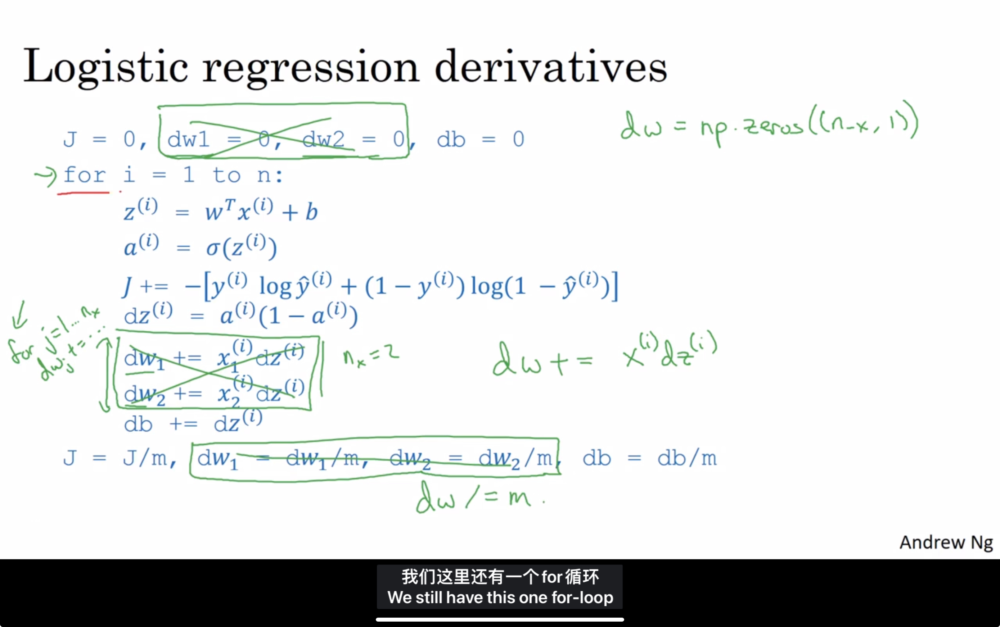
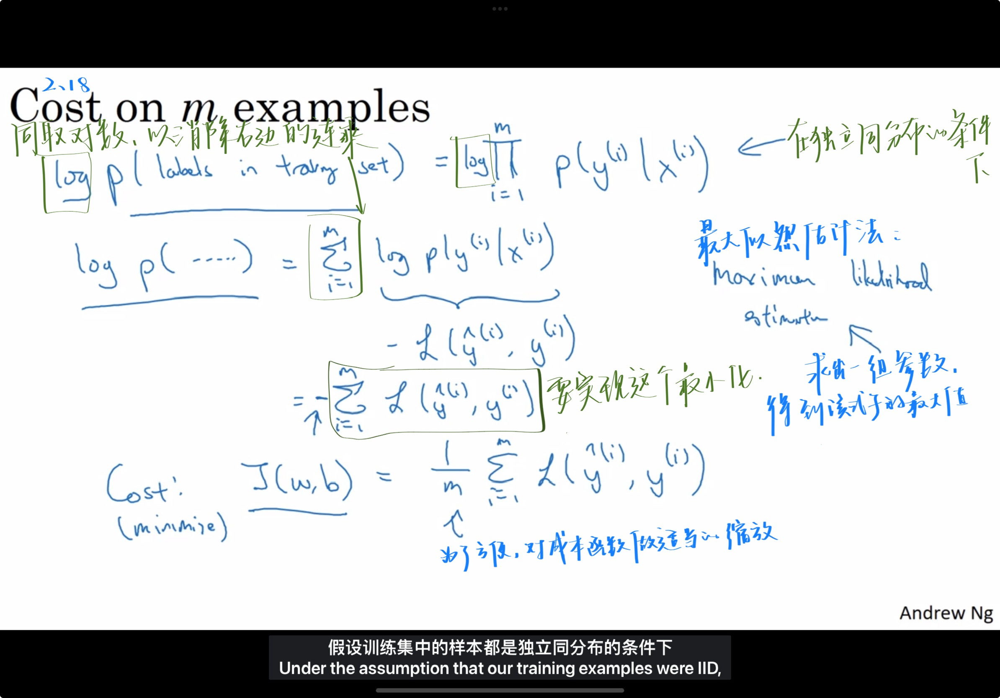

# 吴恩达深度学习

## 0.1 notation

a useful convention would be to take the data associated with different training examples

|                     notation                     |                           meaning                            |
| :----------------------------------------------: | :----------------------------------------------------------: |
|                       $m$                        |               Amount of data/training example                |
|                  $n_{x}$ or $n$                  |                   输入的特征向量$x$的维度                    |
| $(x,y),x \in \mathbb{R}^{n_{x}}, y \in \{0,1\} $ |   一个样本，$x$是$n_{x}$维的特征向量，标签$y$值为$0$或$1$    |
|     $(x^{(i)},y^{(i)})...(x^{(m)},y^{(m)})$      |                第$i$个样本 和 最后一个个样本                 |
|                 $m = m_{train}$                  |                训练集的样本数 #train example                 |
|                  $m = m_{test}$                  |                 测试集的样本数 #test example                 |
|       $X = [x^{(1)},x^{(2)},...,x^{(m)}]$        | $X \in \mathbb{R}^{n_{x} \times m}$<br />这是一个$m$列，$n_{x}$行的矩阵，表示所有的训练集（列向量堆叠）的输入形式 |
|       $Y = [y^{(1)},y^{(2)},...,y^{(m)}]$        | $X \in \mathbb{R}^{1 \times m}$<br />这是一个$m$列，$1$行的矩阵，表示输出标签 |
|                       w:=                        |                            更新w                             |


## 0.2 What you'll learn

Courses in this sequence (Specialization微专业) :

1. Neural Networks and Deep Learning 神经网络和深度学习
   1. Week 1 :    Introduction
   2. Week 2 :    Basics of Neural Network programming 神经网络编程框架
   3. Week 3 :    One hidden layer Neural Networks 单隐层神经网络
   4. Week 4 :    Deep Neural Networks 多层神经网络
2. Improving Deep Neural Networks: Hyperparameter tuning, Regularization and Optimization 超参数调整、正则化、优化算法
3. Structuring your Machine Learning project 结构化你的机器学习工程
4. Convolutional Neural Networks 卷积神经网络（CNNs）
5. Natural Language Processing (NLP) : Building sequence models 自然语言处理：序列模型

## Week 1. Introduction

1. Week 1 :    Introduction
2. Week 2 :    Basics of Neural Network programming 神经网络编程框架
3. Week 3 :    One hidden layer Neural Networks 单隐层神经网络
4. Week 4 :    Deep Neural Networks 多层神经网络

### 1.1 WHAT IS NEURAL NETWORKS

#### 神经网络里面的神经元

由图可得，通过==神经元==可以从输入x到输出y。



### 1.2 Supervised Leaning in Neural Network

用神经网络进行监督学习

#### NN types


Different NN types are used for different problems:


#### Structured Data and Unstructured Data

| Structured Data                                | Unstructured Data                         |
| ---------------------------------------------- | ----------------------------------------- |
| database                                       | audio/image/text                          |
| each feature/column has a well-defined meaning | no well-defined meaning for pixels/tokens |
| 表格型数据                                     | 一些抽象的数据（音频，图像，文本）        |

### 1.3  Why is deep learing taking off

- 讨论深度学习崛起别后的一些主要驱动因素


- 传统学习算法
  - 支持向量机 support vector machine
  - 逻辑回归 logistic regression


#### Scale drives deep learning progress

- 在小训练集阶段
  - 各种算法（NN or 传统算法） 之间的相对顺序并不是很明确
  - 性能取决于人的skill at hand engineering features
  - ✅有人训练的一个SVM表现得比一个大型神经网络更好
- 在大训练集阶段
  - 大型的神经网络占主导地位 dominate the other approaches

#### computation faster

#### new algorithms

e.g. from sigmoid to ReLU, which in turn speeds up computation too

### 1.4 Test

> 1. What does the analogy "Al is the new electricity" refer to?
>
> - Similar to electricity starting about 100 years ago, Al is transforming multiple industries.
>
> - Al is powering personal devices in our homes and offices, similar to electricity.
>
> - Through the "smart grid"【智能电网】, Al is delivering a new wave of electricity.
>
> - Al runs on computers and is thus powered by electricity, but it is letting computers do things not possible before.

请注意: 吴恩达在视频中表达了同样的观点。

A

> 2. Which of these are reasons for Deep Learning recently taking off? (Check the three options that apply.)
>
> - We have access to a lot more computational【计算的】 power.
>
> - Deep learning has resulted in significant improvements in important applications such as online advertising, speech recognition, and image recognition. 
>
> - Neural Networks are a brand new field.
>
> - We have access to a lot more data.

A D 三个答案？？

> 3. Recall this diagram of iterating over different ML ideas. Which of the statements below are true? (Check all that apply.)
>
> 
>
> - Being able to try out ideas quickly allows deep learning engineers to iterate more quickly.
>
> - Faster computation can help speed up how long a team takes to iterate to a good idea.
>
> - It is faster to train on a big dataset than a small dataset.
>
> - Recent progress in deep learning algorithms has allowed us to train good models faster (even without changing the CPU/GPU hardware).

ABD


> 4. When an experienced deep learning engineer works on a new problem, they can usually use insight【洞察力】 from previous problems to train a good model on the first try, without needing to iterate multiple times through different models. True/False?
>
>    - True
>
>    - False

==B==

> Note:  Maybe some experience may help, but nobody can always find the best model or hyperparameters without iterations.(注：也许之前的一些经验可能会有所帮助，但没有人总是可以找到最佳模型或超参数而无需迭代多次。)

> 5. Which one of these plots represents a ReLU activation function?
>
> 
>
> 

> 6. Images for cat recognition is an example of “structured” data, because it is represented as a structured array in a computer. 
>
>    True/False?

False

> 7. A demographic【人口统计学】 dataset with statistics on different cities' population, GDP per capita, economic growth is an example of "unstructured" data because it contains data coming from different sources. 
>
>    True/False?

False

> 8. Why is an RNN (Recurrent【循环】 Neural Network) used for machine translation, say translating English to French? (Check all that apply.)
>
>    - ==It can be trained as a supervised learning problem.==
>
>    - It is strictly more powerful than a Convolutional Neural Network (CNN).
>
>    - It is applicable【使用的】 when the input/output is a sequence (e.g., a sequence of words).
>
>    - RNNs represent the recurrent process of Idea->Code->Experiment->idea

==A==C

> Note: ==RNN can be trained as a supervised learning problem.==

> 9. In this diagram which we hand-drew in lecture, what do the horizontal axis (x-axis) and vertical axis (y-axis) represent?
>
> 

- x-axis is the amount of data
- y-axis (vertical axis) is the performance of the

> 10. Assuming the trends described in the previous question's figure are accurate (and hoping you got the axis labels right), which of the following are true? (Check all that apply.)
>
> - Decreasing the size of a neural network generally does not hurt an algorithm's performance, and it may help significantly.
>
> - Increasing the training set size generally does not hurt an algorithm's performance, and it may help significantly.😄
>
> - Decreasing the training set size generally does not hurt an algorithm's performance, and it may help significantly.
>
> - Increasing the size of a neural network generally does not hurt an algorithm's performance, and it may help significantly.😄

## Week 2. Basics of Neural Network programming 神经网络编程的基础知识

### 2.1 Binary Classification

**Logistic regression** is an algorithm for binary classification.

In binary classification, our goal is to learn a **classifier**【分类器】.

- 构造神经网络时，用列向量堆叠，会让构建过程much easier

### 2.2 Logistic Regression

这是一个用在**输出y标签是0或1的监督学习问题**上的学习算法。

> 也就是二元分类问题




- 给出$X$， 我们想要获得$\hat{y} = P(y=1|x)$，即输出为$y$的概率。

$$
x \in \mathbb{R}^{n_{x}},且 \hat{y} \in [0,1]
$$

- 参数：

$$
w \in \mathbb{R}^{n_{x}}, b \in R
$$


- 输出：

因为$\hat{y} \in [0,1]$，所以才要==加上sigmod函数==。$w^{T}x + b$的取值范围太大了，是$(-\infty,+\infty)$
$$
\hat{y} = \sigma(w^{T}x + b), where \, \sigma(z) = \frac{1}{1+e^{-z}}
$$


- 目的：

不断地调整两个参数，使得==损失函数==最小。


### 2.3 Logistic Regression loss function and cost function 

```
!!! note
Lost function【损失函数】 是在单个训练样本中定义的，它衡量了在单个训练样本上的表现，是一个凸函数
Cost function【成本函数】 是针对所有训练样本的，它衡量了在全体训练样本上的表现，是一个凸函数
```




**成本函数被定义为平均值，即1/m 的损失函数之和**

> - 目标
>   - loss function 尽量的小
>     - 当标签y = 1，我们需要 $\hat{y}$尽量的大
>     - 当标签y = 0，我们需要 $\hat{y}$尽量的小
>     - 正好符合我们的直觉
>   - cost function 尽量的小

### 2.4 Gradient Descent

用梯度下降法去训练或学习训练集上的参数 $w$ 和 $b$

- 从初始点开始朝最陡的下坡方向走一步-------即梯度下降一步-------即迭代一次
  - $w := w - \alpha \frac{d J(w,b)}{dw}$
    - 代码：$w := w - \alpha dw$
  - $b := b - \alpha \frac{d J(w,b)}{db}$
    - 代码：$b := b - \alpha db$
  - $\alpha$是学习率，和更新的每一步的步长有关系
- 不断下降，很有希望收敛到全局最优解




### 2.5 Derivatives

```
!!! note
对微积分和导数有直观的理解
```

### 2.6 More derivatives examples

- The derivative of the function just means the slope of the function. The slope of the function can be different at different points on the function
- If you want to look up the derivative of a function, you can filp open your calculus textbook or look at the Wikipedia.

### 2.7 Computation Graph

神经网络计算是通过前向传播和后向传播过程来实现的。

我们先通过前向传播计算出神经网络的输出，

然后再通过后向传播计算出对应的梯度或导数。

### 2.8 Derivatives with a Computation Graph


- $d var$ means $\frac{dJ}{dvar}$
  - $da$ means $\frac{dJ}{da}$
  - 在代码中就写成dvar就可以了
- 一个后向传播计算的例子
  - 链式法则
  - $\frac{dJ}{du} = \frac{dJ}{dv} \frac{dJ}{du}$

### 2.9 Logistic Regression Gradient descent 逻辑回归的梯度下降法

怎么通过计算偏导数来实现logistic回归的梯度下降法

在本节视频中，使用导数流程图去就算梯度。

梯度下降法应用到logistic回归的一个训练样本上。



### 2.10 Gradient descent on $m$ examples

梯度下降法应用到logistic回归的==$m$==个训练样本上。




### 2.11 Vectorization

向量化是消除你的代码中显式for循环语句的艺术

the art of getting rid of explicit for loops in your code

#### What is vectorization



```
!!! note
只要有其他可能（使用numpy内置函数），就不要使用显式for循环
Whenever possible, avoid explicit for-loops.
```

### 2.12 More vectorization examples


- dot
  - $ U = np. dot(A,v)$
  - 
- exp
  - $ U = np. exp(v)$
- log
  - $ U = np. log(v)$
- abs
  - $ U = np. abs(v)$
- maximun
  - $ U = np. maximun(v,0)$
  - 求出V中所有元素和0之间相比的最大值
- square
  - $ U = V**2$
  - V中每个元素的平方
- Logistic regression derivatives
  - 把2个for循环变成一个了
  - 

### 2.13 Vectorizing Logistic Regression


```
Z = np.dot(w.T,X) + b
# b 本来是一个（1，1）的矩阵，也就是一个实数
# 但是通过广播机制，会扩展成一个（1，m）的行向量
```

### 2.14 Vectorizing Logistic Regression's Gradient Computaion 向量化逻辑回归的梯度输出

- 一次迭代

  - 前向传播
    - 计算出$z$和$a$

  - 反向传播
    - 计算出$da$和$dz$
      - $da=-\frac{y}{b}+\frac{1-y}{1-a}$
      - $dz = a -y$
    - 计算出$dw$和$db$
      - $dw = xdz$
      - $db = dz$
  - 更新
    - 更新$w$和$b$
  
  > 注意⚠️
  >
  > 这里取$x$有两个特征$x_{1}$和$x_{2}$，分别有两个权重参数$w_{1}$和$w_{2}$


### 2.15 Broadcasting in Python

注意只有按元素运算能广播，矩阵乘法维度不一样会直接报错！

更多，在numpy文档中搜索broadcasting


### 2.16 A note on py/numpy ectors


### 2.17 Quick tour of Jupyter/ python notebooks

### 2.18 Explanation of logistic regression cost function(Optional)

> 说明logistic回归成本函数的表达式为什么是这样的
>
> for why we like to use that cost function for logitic regression



## Week 3 :    One hidden layer Neural Networks 单隐层神经网络

### 3.1 Neural Networks Overview

| notation  | meaning                              |
| :-------: | ------------------------------------ |
| 上标$[i]$ | 神经网络中的第$i$层（第0层为输入层） |
| 上标${i}$ | 表示第$i$个训练样本                  |

### 3.2 Neural Network Representation 神经网络的表示

