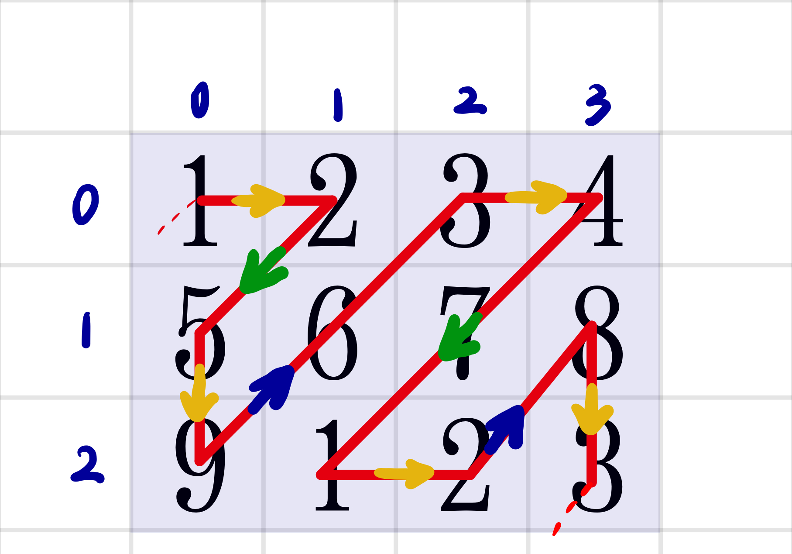

# 498.对角线遍历

## 0. 题目

[0498. 对角线遍历](https://leetcode.cn/problems/diagonal-traverse/)

## 1. 思路

### 模拟大法🧐

看完题目之后，先来模拟一下路线：



#### 找规律

不难发现可以把整个遍历过程看成**一排排**的**整体向上走**和**整体向下走**（注意第一个元素和最后一个元素要分别看成向上走和向下走）。

#### 问题规约：一步步解决小问题

1. 只要不断地`i--`和`j++`就可以实现向上走了，向下走则是`i++`和`j--`；

2. 那么什么时候停止这个方向上的遍历呢？

   当遇上“碰壁”的时候，就可以停止了。在向上走的时候会碰**上壁**和**右壁**，再向下走的时候会碰**下壁**和**左壁**。根据这个规律就很容易写出**循环停止**的条件。

3. 还有一个要解决的问题就是，碰壁之后往哪走？也就是下一排的第一个元素是谁？

   - 整体向上走
     - 碰上壁，向右走
     - 碰右壁，向下走

   - 整体向下走
     - 碰下壁，向右走
     - 碰左壁，向下走

此时思路已经非常清晰了。思路很简单是个笨方法，但是很好写代码～

## 2. 代码

```cpp
class Solution {
public:
    vector<int> findDiagonalOrder(vector<vector<int>>& mat) {
        vector<int> order; // 存放答案

        int row=mat.size(); // 计算行数
        if(row==0)return{};// 空矩阵的处理
        int col=mat[0].size();// 计算列数

        int i=0,j=0; // 从左上角第一个元素开始遍历
        int di=0;//整体的遍历方向：0表示up；1表示down

        while(order.size()<row*col){//注意：不是<=
            if(di==0){  //整体遍历方向为up的话，会碰到上壁或右壁
                while(i>=0 && j<col){ // 所以要判断i和j的合法性
                    order.push_back(mat[i][j]);
                    i--;j++;    // 每遍历完一个元素，都向右向上更新i和j
                }
                i++;j--;// 返回来刚才的while循环中遍历到的最后一个合法的元素
                // 这个时候或者右走（碰上壁），或者向下走（碰右壁）
                if(j==col-1){i++;} // 碰右壁的话，向下走
                else{j++;}// 碰上壁的话向右走
                di=1; // 更换整体的遍历方向为down
            }
            else if(di==1){ //整体遍历方向为down的话，会碰到下壁或左壁；下面的逻辑和上面的逻辑相似。
                while(j>=0 && i<row){
                    order.push_back(mat[i][j]);
                    i++;j--;
                }
                i--;j++;
                if(i==row-1){j++;}
                else{i++;}
                di=0; // 更换整体的遍历方向为up
            }
        }
        return order;// 最后返回答案
    }
};
```

## 3. 效率

**执行用时分布** 0ms 击败100.00%

**消耗内存分布** 21.48MB 击败85.74%

