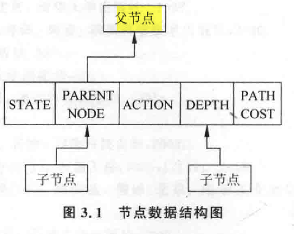
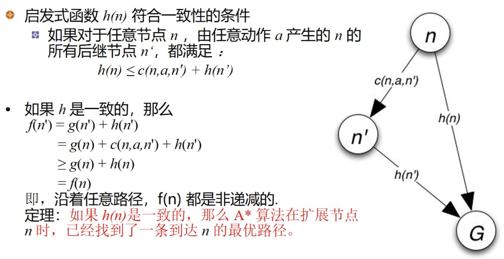
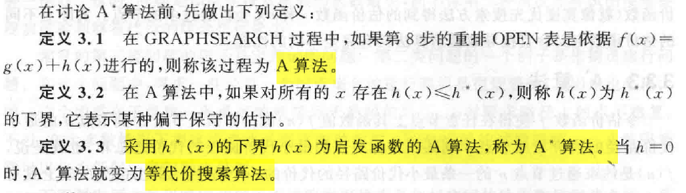
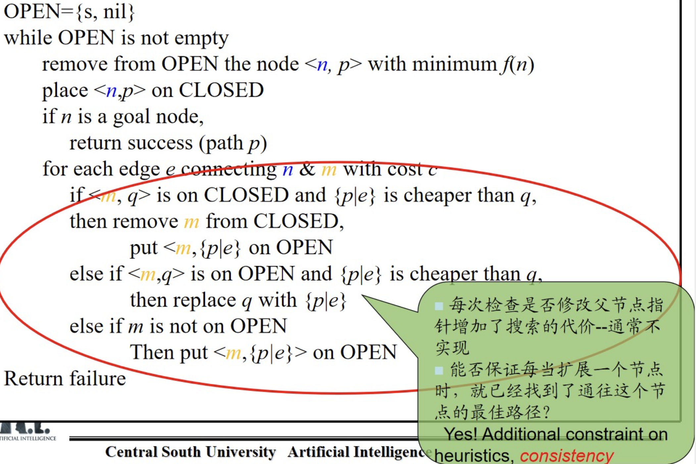
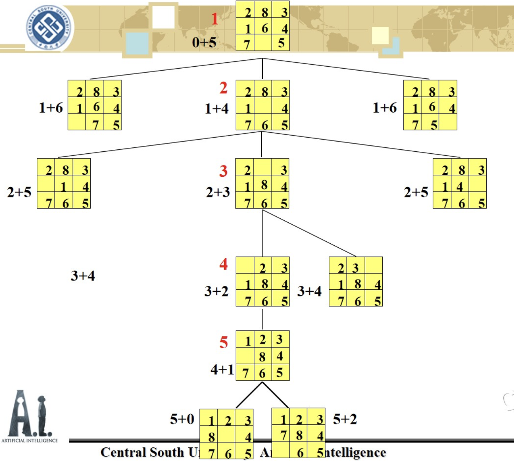

# 第三章 搜索推理技术

- 问题求解
  - 表示（第二章）
    - 状态空间表示
  - 搜索🔍（第三章）
    - 无信息搜索（盲目搜索）
      - 宽度优先搜索
      - 深度优先搜索
    - 有信息搜索（启发式搜索）

## 3.1 图搜索策略 Graph Search Strategy

看成一种在图中寻找路径的方法。

求得把一个数据库变换成另一个数据库的规则序列问题就等价于求得图中的一个路径问题。

### 数据结构

- 图本身

  - 每个表示状态的节点结构中必须有指向父节点的指针

  - 节点的数据结构

    - 

    - | 结构        | 意义                                             |
      | ----------- | ------------------------------------------------ |
      | STATE       | 节点所表示状态的基本信息                         |
      | PARENT NODE | 指针域，指向当前节点的**父节点**                 |
      | ACTION      | 从父节点表示的状态转换到当前节点状态所使用的操作 |
      | DEPTH       | 当前节点在搜索树的深度                           |
      | PATH COST   | 从起始节点到当前节点的路径代价                   |

- OPEN表（用于回溯）

  - 存放已访问但未扩展节点；也称Fronge表，即前沿表
  - 可以走那些节点，但是还没有走；
    - ==宽度优先==
      - 使用**队列**
    - ==深度优先==
      - 使用**堆栈**

- CLOSED表

  - 存放已扩展节点
  - 走过的点

## 3.2 盲目搜索（无信息搜索）

- 没有先验知识，不需要重排open表
- 宽度优先、深度优先、等代价搜索
- 求解比较简单的问题

### 3.2.1 BFS

- 宽度优先搜索
  - 一种高代价搜索，但若有解的存在，一定能找到

#### **算法**步骤

（OPEN表是一个队列结构）

1. 把起始节点放到OPEN表中（如果该起始节点为一目标节点，则求得一个解答）
2. 如果OPEN表是一个空表，则没有解，失败推出；否则继续。
3. 把第一个节点（节点n）从OPEN表中移出，并把它放入CLOSED的扩展节点表中。
4. 扩展节点n，如果没有后继节点，则返回到步骤2.
5. 把n的所有后继节点放到OPEN表的**末端**，并提供这些后几点回到n的指针。
6. 如果n的任一个后继节点是个目标节点，则找到一个解答，成功退出；否则转向步骤2。

###  3.2.2 DFS

- 深度优先搜索

> ⚠️
>
>  为了避免考虑太长的路径(防止搜索过程沿着无益的路径扩展下去)，往往给出一个节点扩展的最大深度—— **==深度界限==** 

#### 定义：节点的深度

1. 起始节点的深度为0
2. 任何其他节点的深度等于其父节点深度+1

> 🙋BFS 和 DFS 在实现上有什么区别？
>
> BFS使用的是队列
>
> DFS使用的是栈

#### **算法**步骤

（OPEN表是一个栈）

1. 将起始节点S放进OPEN表中（若起始节点就是一目标节点，则获得一个解）
2. 判断OPEN表是否为空，如果为空则失败退出
3. 将第一个节点n从OPEN表中放进CLOSED表中
4. **如果节点n的深度等于最大深度，则转向步骤2**
5. 扩展节点n，产生其所有的后裔，并把它们放进OPEN表的前头；如果没有后裔，则转向步骤2
6. 如果后继节点中有任一个为目标节点，则求得一个解，成功退出；否则转向步骤2。

### 3.2.3 等代价搜索

在等代价搜索算法中，不是描述沿着等长度路径进 行的扩展，而是描述沿着==等代价路径==进行的扩展。

> 能否提前预估解在哪条路上？
>
> 使用启发式搜索

$c(i,j)$：节点i到其后继节点j的连接弧线代价

$g(i)$：从起始节点S到i的最少代价路径上的代价

#### 算法步骤

1. 将起始节点S放进OPEN表中；如果S就是目标节点，则求得一个解；否则令$g(S)=0$;
2. 如果OPEN表是一个空表，则失败推出
3. 从OPEN表中选择一个节点i，使其$g(i)$为最小。如果有几个节点都合格，那么就要选择一个目标节点作为节点i（如果其中有目标节点的话）；否则就从中选择一个作为节点i。把节点i从OPEN表中移到CLOSED表中
4. 如果节点i为目标节点，则求得一个解
5. 扩展节点i。如果没有后继节点，则转向步骤2
6. 对于节点i的每一个后继节点j，计算$g(j)=g(i)+c(i,j)$，并把所有后继节点j放进OPEN表中。提供回到节点i的指针
7. 转向步骤2

## 3.3 启发式搜索（有信息）

利用启发信息的搜索方法叫做启发式搜索方法

- 对OPEN表按估价函数的大小排序
- 不同的估价函数体现出来的效率不同

### 3.3.1 启发式搜索策略和估价函数

- 有序搜索（最佳优先搜索）

  - 用符号$f$来标记估价函数

  - 用$f(n)$表示节点n的估价函数值。
  - 用函数$f$来排列OPEN表上的节点（按照它们$f$函数值的递增顺序排列

- 使用的算法：有序搜索算法或最佳优先算法

#### 估价函数

$$
f(n)=h(n)+g(n)
$$

- $h(n)=0:$UCS,非启发式算法
- $g(n)=0:$贪婪算法，无法保证找到解
- 一个节点的希望程序越大，其f值就越小。被选为扩展的节点，是估价函数最小的节点。

### 3.3.2 有序搜索

总是选择最有希望的节点作为下一个要扩展的节点。

### 3.3.3 A*算法

特点在于**估价函数**的定义上：

估算出**从节点S到节点n的最小代价路径的代价**与节点**n到某一目标节点的最小代价路径的代价**之总和。

- 既关注过去，又关注将来。

#### 🚫限制条件

- $g(n)$>0 ,

- $h(n)$不大于x到目标的实际代价；满足一致性和单调性。

##### 一致性

#### 📒记号

| 记号                         | 意义                                                         |
| ---------------------------- | ------------------------------------------------------------ |
| $k(n_{i},n_{j})$             | 任意两个节点$n_{i},n_{j}$之间的最小代价路径的实际代价。 对于两节点之间没有通路的节点，函数k没有定义 |
| $h^{*}(n)$                   | 整个目标节点集合上所有$k(n,t_{i})$中最小的一个。 就是从n到目标节点最小代价路径的代价 |
| $g^{*}(n)=k(S,n)$            | $S$是起始节点，$n$是任意节点。                               |
| $f^{*}(n)=g^{*}(n)+h^{*}(n)$ | 从节点S到节点n的一条最佳路径的实际代价**+**从节点n到某目标节点的一条最佳路径的代价 |
| $f$                          | $f^{*}$的估计 $f(n)=g(n)+h(n)$                          |

#### 🖊️**定义**

#### 💻伪代码

- $p$是路径
- | 表示连接
- 判断最小路径有没有更新，如果有更小的就替换。

> **八数码问题**
>
> - $f(x)=g(x)+h(x)$
> - $g(x):$从初始状态到$x$需要进行的移动操作的次数
> - $h(x):$所有棋子与目标位置的曼哈顿距离之和
>   - 曼哈顿距离：阶梯距离
>   - 仍满足估价函数的限制条件
>
> 

