# 第二章 知识表示方式（考查的重点）

## 2.1 状态空间(State Space)表示

这种==基于解答空间的问题表示和求解方法==就是 状态空间法，它是==以**状态**和**算符(**operator)为基础来表示和求解问题==的;

- state
- operator
  - 使问题从 一种状态变化为另一种状态的手段

#### 1️⃣ 15数码难题

- state
  - 一维数组
  - 整个state space应该是一个树状图
- operator
- search
  - 暴力搜索
  - 试探搜索

#### 2️⃣ 月历魔柱

#### 3️⃣ 魔方 8数码问题

### 2.1.2 状态图示法

- 节点
- 弧线
- 有线图
- 路径
- 代价cost

#### 1️⃣ 路径规划

- Initial state
- Operators
- Goal state

#### 2️⃣ 猴子和香蕉问题🐒🍌

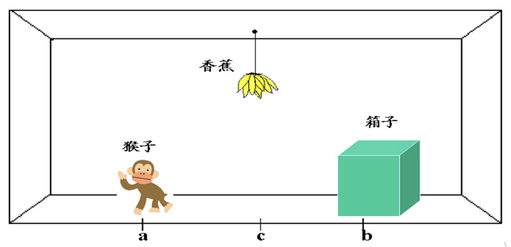

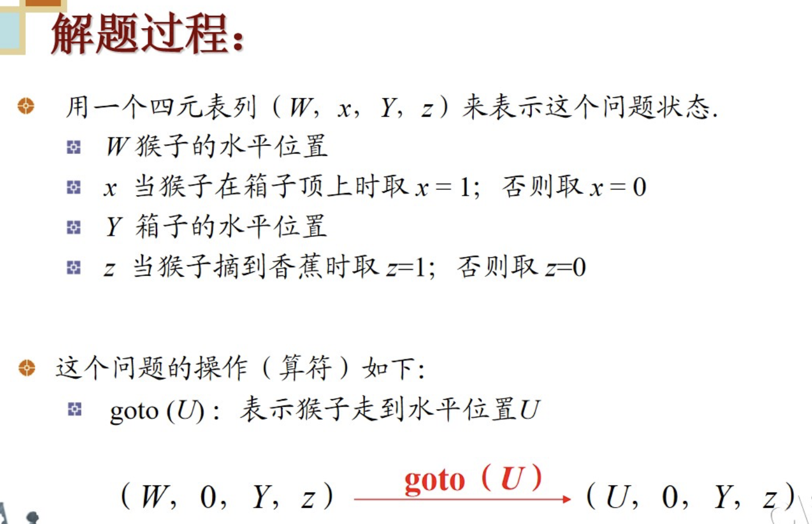

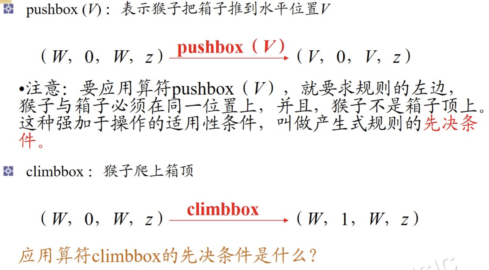

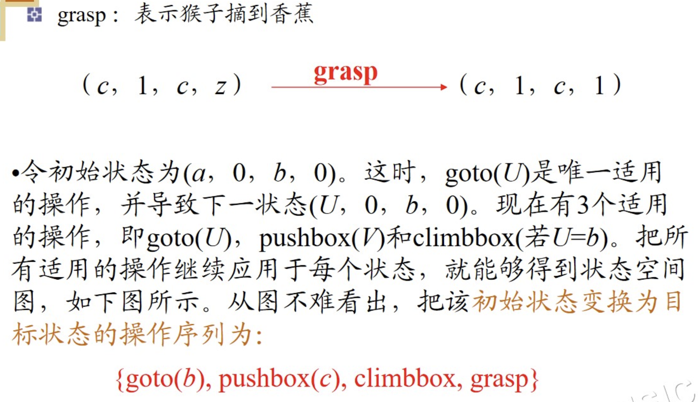

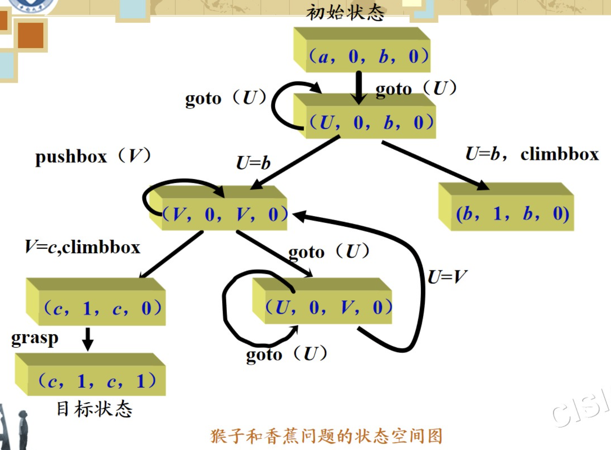

- 用什么数据结构去表示问题的状态
- 

https://blog.csdn.net/qwer1234ww/article/details/132434009

https://towardsai.net/p/artificial-intelligence/monkey-banana-problem-in-prolog

#### 3️⃣传教士野人过河问题

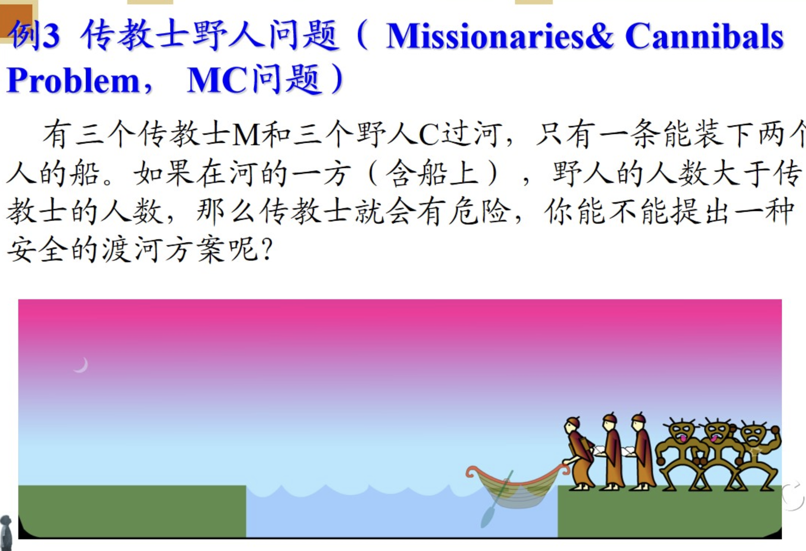

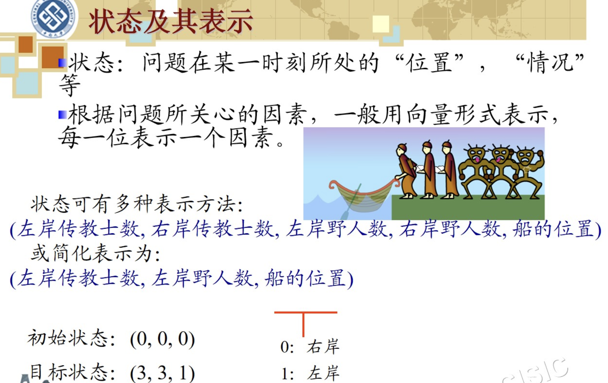

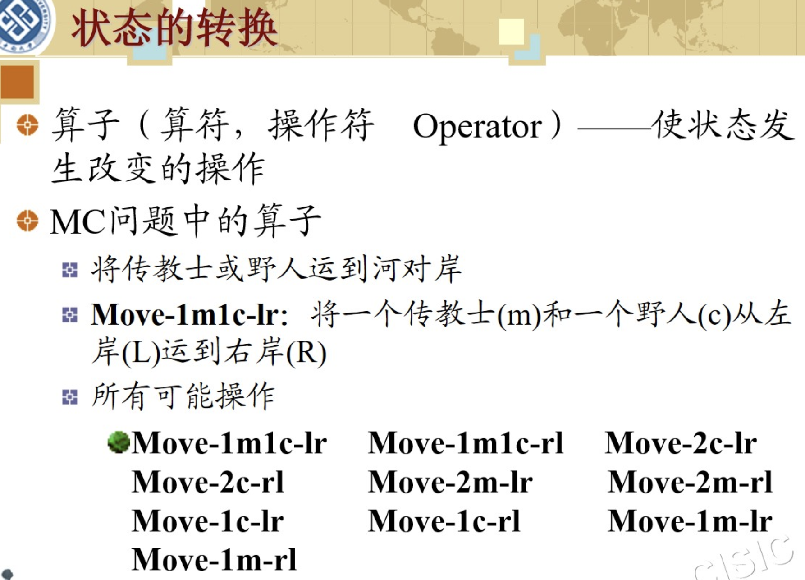

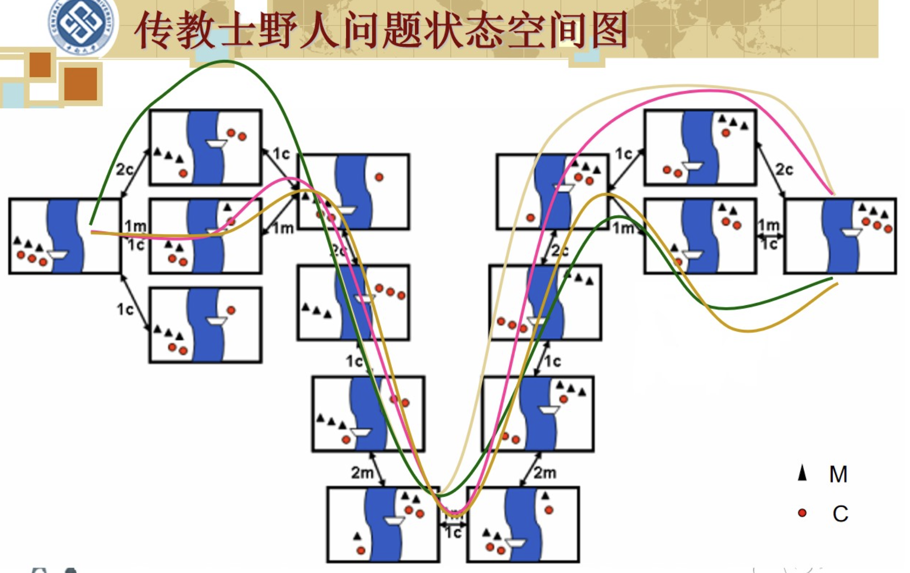

## 2.2 问题规约(Problem Reduction)表示

- 思想
  - 把问题分解为子问题及子-子问题，然后解决较小的问题。对该问题的某个具体子集的解答就意味着对原始问题的一个解答。
- 组成部分
  - 一个初始问题描述
  - 一套把问题转换为子问题的操作符
  - 一套本原问题描述
- ==实质==
  - 从目标出发==逆向推理==

#### 1️⃣汉诺塔问题

### 2.2.2 与或图表示

#### 术语

## 2.3 谓词逻辑(Predicate Logic)表示

### 概念

- 逻辑语句
  - 一种形式语言，它能够**把逻辑论证符号化**，并用于证明定理，求解问题
- 形式语言
  - 严格地按照**相关领域的特定规则**，以**数学符号（符号串）形式**描述该领域有关客体的表达式
    - c语言也是形式语言
    - 解方程的过程也是一种形式语言

### 2.3.1 谓词演算

#### 1. 语法和语义

- 基本符号
  - 谓词符号（形容词、动词）
  - 变量符号
  - 函数符号
  - 常量符号
  - 括号和逗号
- 原子公式
  - 只包含一个谓词？？？？
  - 由**若干谓词符号**和项组成的谓词演算
  - 是谓词演算的基本积木块

#### 2. 连词和量词

##### 命题演算

- 与及合取（conjunction）
- 或及析取（disjunction）

- 蕴涵（impllication）：左式叫前件，右式叫后件。如果...那么...的意思
- 非（not）

##### 谓词演算

> 值得指出的是，本书中所用到的谓词演算为**一阶谓词演算**，不允许**对谓词符号或函数符号**进行量化（即不对他们进行约束，任意或存在）

- 全称量词
  - 自由变量；而且是有辖域的！
- 存在量词

> 有**人**每天**下午**都去打篮球，用谓词公式去表示这个事实
>
> 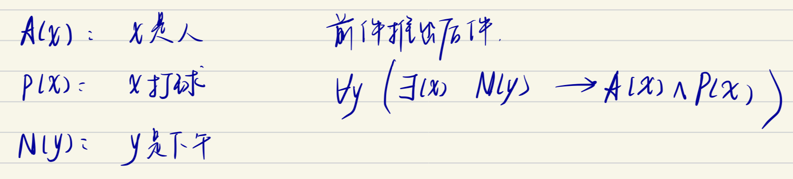

### 2.3.2 谓词公式

- 定义
  - n元谓词公式
- 分子谓词公式
- 合式公式（WFF，well-formed formulas）
  - 用它的递归定义去检验是否为合式公式

### 2.3.3 置换与合一

- 置换
  - 概念
    - 假元推理
    - 全程化推理
    - 综合推理
  - 性质
    - 可结合律
    - 不可交换律

## 2.4 语义网络表示Samantic Network Representation

> 用图来表示知识：作为描述人类联想记忆的一种心理学模型

### 定义

语义网络是知识的一种结构化图解表示，它由 节 点 和 弧 线 或 链 线 组 成 。 节 点 用 于 表 示实体、概念和情况等，弧线用于表示节点间的关系。

### 组成部分

- 词法
  - 决定表示词汇表中允许有哪些符号，它涉及各个节点和弧线
- 结构
- 过程
- 语义

### 2.4.1 二元语义网络的表示

- 表示简单事实和占有关系
- 选择语义基元问题
  - 用一组基元来表示知识，以便简化表示，并可用简单知识来表示更复杂的知识
- 可以毫无困难地表示二元关系
  - 用**图**来表现

> 水草是**（AKO）**草，且生长在水中
>
> 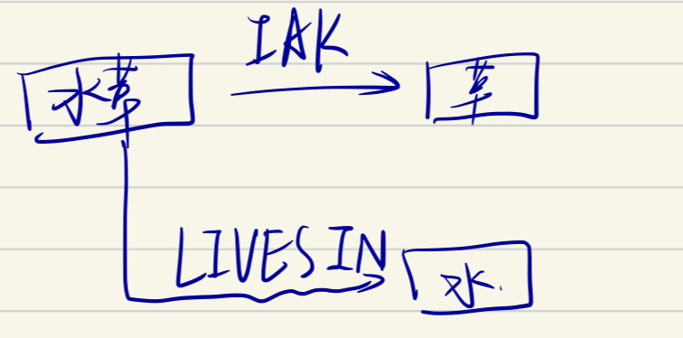

⚠️**弧上是动词！**

### 2.4.2 多元语义网络的表示

### 2.4.3 语义网络的推理过程

- 定义
  - 值节点
    -  在 链 的 尾 部 的 节 点
  - 节点的槽（相当于链）
    - 一个槽可以有多个值
- 搜查和匹配的过程
  - 

## 2.5 框架表示

#### 2.5.1 表示

- 框架是一种数据结构，一种结构化知识表示法。

- 采用语义网络中的`节点-槽-值`表示结构

- 语义网络 可看 做节点和弧线的集合，也可以视 框架的集合。

## 2.6 本体技术 Ontology Technology

#### 2.6.1 概念

本体是概念化的 一个显式的规范说明或表示

#### 2.6.2 组成与分类

- 组成
  - 概念
  - 关系
  - 函数
  - 公理：用于描述一些永真式
  - 实例
- 分类
  - 知识表示本体
  - 通用常识本体
  - 领域本体
  - 语言学本体
  - 任务本体

#### 2.6.3 本体的建模

- 五阶段法对NUDT5本体建模（作为了解✔️）
  - NUDT5本体：一个数据集，用于信息系统与管理各实验室的知识管理
  - 阶段1: 数据收集与分析
    - 从组织的文档、报告中抽取出相关的概念："Entity, Document, Author, Title..."
  - 阶段2: 建立一个字典
    - 为上一个阶段抽取出来的概念下定义（添加描述）
  - 阶段3: 对字典进行求精，建立内容更丰富的表
    - 上一个步骤，各个词都是孤立的
    - 梳理出各个概念之间的关系
      - 顶层概念表；中间层概念表
      - 顶层关系表；中间层关系表（越模糊的关系越在顶层）
  - 阶段4: 用RDFS语言描述上述各表
    - rdfs和rdf是W3C定义的两个RDFS
  - 阶段5: 定义关系的代数属性，定义知识的推理规则

### 2.7 过程表示（Others）

- 将有关某一问题领域的**知识**，连同如何使用这些知识的**方法**，均**隐式**地表达为**一个求解问题的过程**

### 2.8 小结

重点掌握前面四种表示方法

| 方法     | 初始问题 | 算符                               | 目标     | 结果 |
| -------- | -------- | ---------------------------------- | -------- | ---- |
| 状态空间 | 状态     | 算符                               | 目标状态 |      |
| 问题规约 | 节点     | 弧线                               | 节点     |      |
| 谓词逻辑 | 合适公式 | 子句集 置换合一 消解反演 | 根节点   |      |
| 语义网络 | 节点     | 链                                 | 目标网络 |      |

