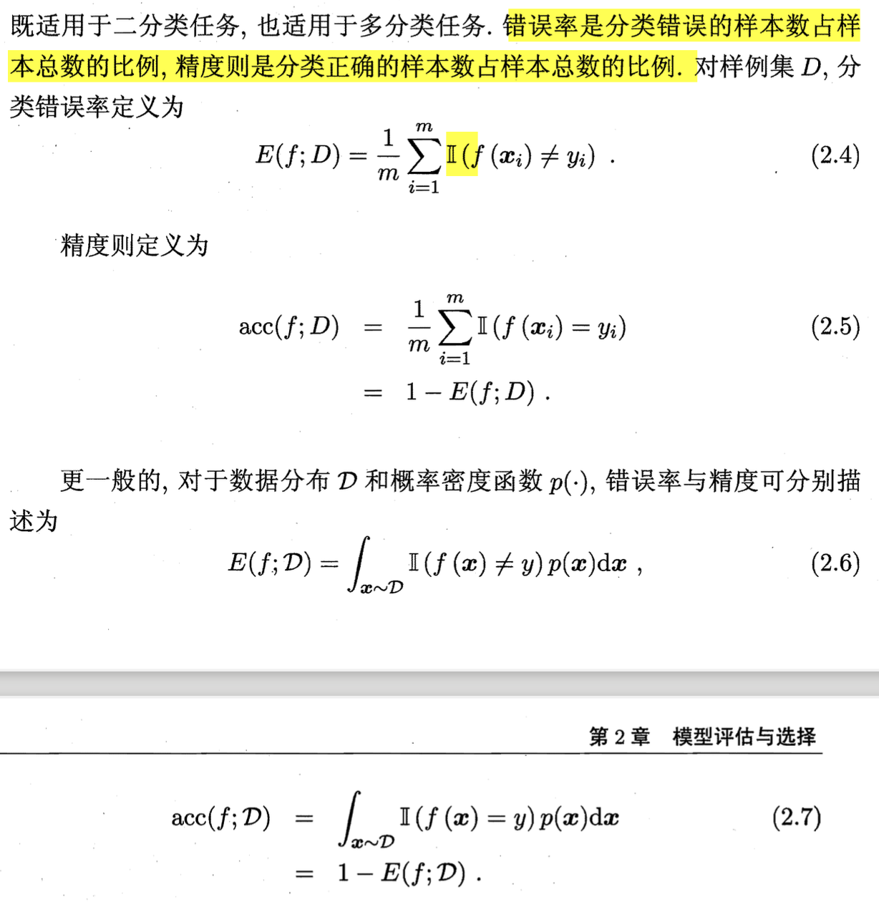
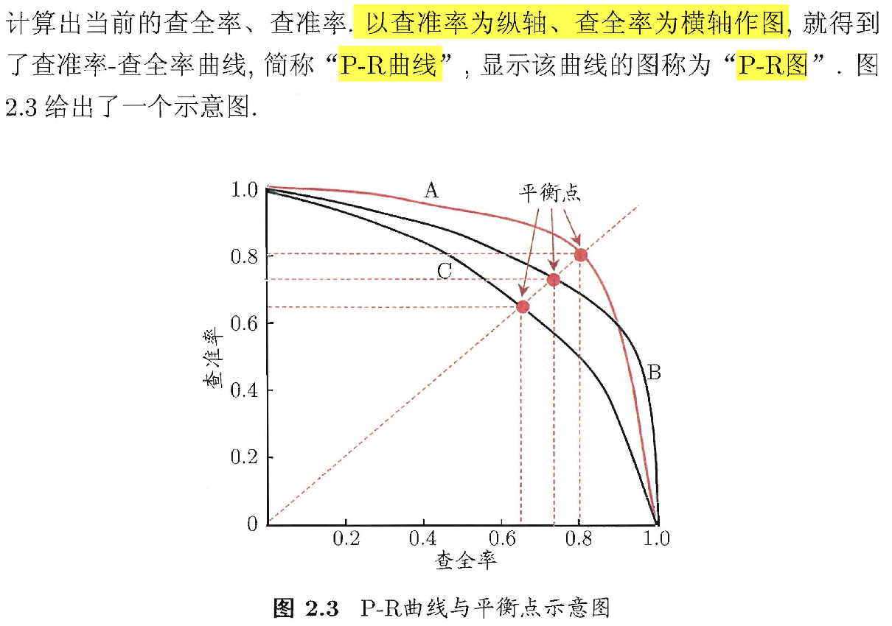
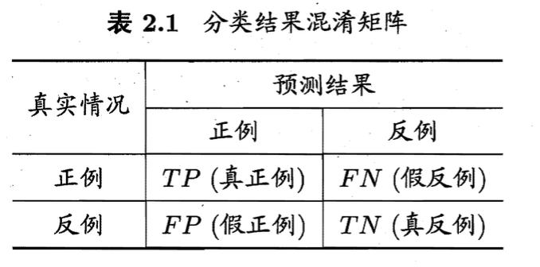

# 02 模型评估与选择

## 2.1 经验误差与过拟合

- **错误率$E$**
  - $E = \frac{a}{m}$
    - $m$个样本中有$a$个样本分类错误
- **精度** = 1 - 错误率
- 误差
  - 预测值和真实值之间的差异
  - ==训练误差、经验误差==
    - 学习器在训练集上的误差
  - ==泛化误差==
    - 学习器在新样本上的误差
- 过拟合
  - 原因：学习能力过于强大
- 欠拟合
  - 原因：学习能力低下
  - 解决
    - 决策树学习中扩展分支
    - 在神经网络学习中增加训练轮数

## 2.2 评估方法

- 以**测试集**上的“==测试误差==”作为泛化误差的近似
  - 通过对**数据集**$D$进行适当的处理，从中产生出**训练集**$S$和**测试集**$T$

### 2.2.1 留出法 hold-out

$D = S \cup T, S \cap T = \varnothing$

> ⚠️
>
> 1. 训练/测试集的划分要尽可能地保持数据分布的一致性
>
> - “分层采样”
>
> 2. 一般要采用若干次随机划分、重复进行实验评估后取平均值作为**留出法**的评估结果
> 3.  常见的划分：将大约 2/3 rv 4/5 的 样本用于训练，剩余样本用于测试.

### 2.2.2 交叉验证法 cross validation

1. 将D划分为k个大小相似的互斥子集，每个子集都尽可能保持数据分布的一致性
2. 每次用k-1个子集的并集作为训练集，余下的那个子集作为测试集。这样就可以作k次训练和测试
3. 返回k个测试结果的均值

> 1. 该方法评估结果的稳定性和保真性很大程度上取决于k的取值
>
> - "k折交叉验证"
> - k最常取10，或5，或20
>
> 2. 通常要随机使用不同的划分重复 p次，最终的评估结果是这 p次 k折交叉验证结果的均值。
> 3. 留一法LOO
>    - 假定数据集 D 中包含 m 个样本， 令 k=m 
>    - 留一法的评估结果往往被认为比较准确
>      - 留一法的估计结果也未必永远比其他评估方法准确;"没有免费的午餐"定理对实验评估方法同样适用.
>    - 在数据集比较大时，训练 m 个模型的计算开销可能是难以忍受的

### 2.2.3 自助法 bootstrapping

> 估计偏差
>
> - 前两个方法中的训练样本规模和D的规模是不一样的
> - 自助法是为了减少训练样本规模不同造成的影响，同时还能比较高效地进行试验估计

给定包含m个样本的数据集D，我们对它进行采样产生数据集D‘

1. 每次随机从D中挑选一个样本，将其放入D’（该样本可以被再次采样到）
2. 🔁重复第一个步骤m次，得到一个包含m个样本的数据D‘

> D中有一部分样本会在D‘中多次出现，而有些样本不出现。
>
> 通过计算，D中约有36.8%的样本未出现在采样数据集D’中。

| 训练集 | 测试集 |
| ------ | ------ |
| D‘     | D\D'   |

> - 训练集有m个样本
> - 测试集仍有数据总量的1/3的、没在训练集中出现的样本

| 数据集较小、难以有效划分训练/测试集 | 初始数据量足够     |
| ----------------------------------- | ------------------ |
| 自助法                              | 留出法、交叉验证法 |

### 2.2.4 调参与最终模型

对每个参数选定一 范围和变化步长

> 例如在 [0， 0.2] 范围内以 0.05 为步长，则实际要评估的候选参数值有 5 个，最终是从这 5 个候选值中产生选定值.

#### 训练集vs验证集vs测试集

训练数据 = 训练集 + 验证集（用于模型选择和调参）

> ⚠️
>
> 我们通常把学得模型在实际使用中遇到的数据称为**测试数据**，为了加以区分，模型评估与选择中用于评估测试的数据集常称为"**验证集**" (validation set). 
>
> 例如，在研究对比不同算法的泛化性能时，我们用测试集上的判别效果来估计模型**在实际使用时的泛化能力**，而把**训练数据**另外划分为训练集和验证集，**基于验证集上的性能来进行模型选择和调参.**

## 2.3 性能度量

- 衡量模型泛化能力的评价标准
- 反映任务需求
- 把学习器预测结果$f(x)$和真实标记$y$进行比较

### 2.3.1 错误率和精度

### 2.3.2 查准率、查全率与F1

- 查准率（precision）、查全率（recall）一对矛盾的度量.
  - 查准率关注选出来的瓜有多少是好的
  - 查全率关注有没有选出全部的好瓜

#### 两个学习器的比较

1. 若一个学习器的 P-R 曲线被另一个学习器的曲线完全**"包住"** ， 则可断言后者的性能优于前者。

2. 比较 P-R 曲线下**面积**的大小，它在一定程度上表征了学习器在查准率和查全率上取得相对"双高"的比例。
3. **平衡点**（BEP）：“查准率=查全率”时的取值。BEP值高的学习器性能更佳。
4. **F1度量**

$$
F1 = \frac{2 \times P \times R}{P + R}=\frac{2 \times TP}{样例总数+TP-TN}
$$

- 

5. $F_{\beta}$——F1量度的一般形式：$\beta=1$时退化为标准的F1；$\beta>1$查全率有更大影响；$\beta<1$查准率有更大影响。
6. macro-P, macro-R, macro-F1
7. Micro-P, macro-R, micro-F1

### 2.3.3 ROC和AUC

####  ROC

- 受试者工作特征" (Receiver Operating Characteristic)曲线
  - 纵轴是"真正例率" (True Positive Rate，简称 TPR), $TPR = \frac{TP}{TP+FN}$
  - 横轴是"假正例率" (False Positive Rate，简称 FPR), $FPR = \frac{FP}{TN+FP}$

#### 通过ROC图比较学习器

1. 包住
2. **AUC**：比较 ROC 曲线下的面积AUC

### 2.3.4 代价敏感错误率与代价曲线

...