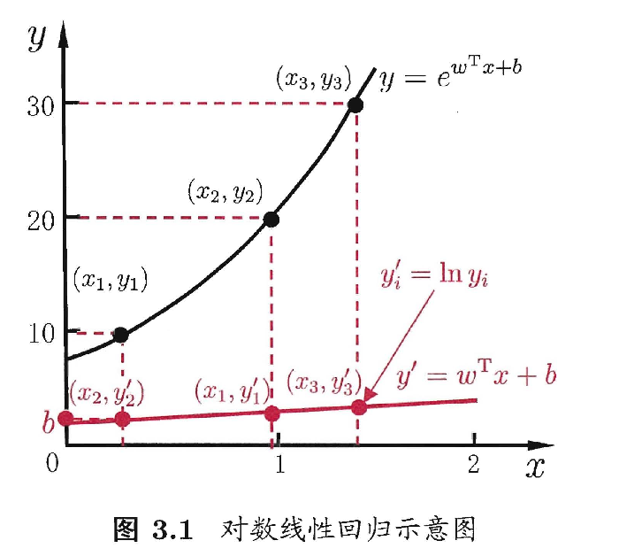
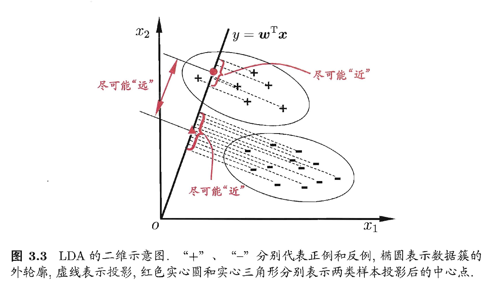

# 03 线性模型

## 3.1 基本形式

$$
f(x)=w_{1}x_{1}+w_{2}x_{2}+...+w_{d}x_{d}+b
$$

向量形式如下：
$$
f(x)=w^{T}x+b
$$

> $w、b$学得之后，模型就确定了✅

- 形式简单，易于建模
- 蕴含着机器学习中的一些重要的基本思想
- 可解释性
  - w直观地表达了各属性在预测中的重要性

## 3.2 线性回归

多元线性回归：样本又d个属性描述

>  使用线性回归模型进行回归学习

### 数值化

- 若属性值间存在“序”的关系
  - 转化为连续值
    - e.g.$\{高,矮\} \rightarrow \{1.0,0.0\} $ or  $\{高,中，低\} \rightarrow \{1.0,0.5,0.0\} $ 
- 若属性值间不存在“序”的关系
  - 假设有k个属性值，则通常转化为k维向量
  - e.g. $西瓜，南瓜，黄瓜 \rightarrow (0,0,1),(0,1,0),(1,0,0)$

> 若无序属性连续化，会不恰当地引入序关系，对后续处理如距离计算等造成误导

### 目标：确定$w,b$

#### 1. 最小化均方误差——最小二乘法

- 均方误差对应了最常用的“欧氏距离”
- 基于均方误差最小化来进行模型求解的方法称为“最小二乘法”
  - 试图找到一条直线，让所有样本到直线上的欧氏距离之和最小
- 求解w和b使均方误差最小化的过程，为线性回归模型的最小二乘**“参数估计”**
  - 1. 将$E_{(w,b)}$分别对w和b求导
    2. 然后令求导结果为0，就可以得到w和b最优解的闭式解

- 当$w,b$有多个解的时候，将由学习算法的归纳偏好决定哪个解作为输出
  - 常见的做法是引入**正则化项**

### 对数线性回归

令模型预测值逼近$y$的衍生物：$lny$
$$
lny = w^{T}x +b
$$

> 式(3)在形式上仍是线性回归，但实质上已经是在求取输入空间到输出空间的非线性函数映射。
>
> 对数函数起到了将线性回归模型的预测值与真实标记联系起来的作用。
>
> 

### 广义线性模型

考虑单调可微函数$g(·)$，令
$$
y = g^{-1}(w^{T}x +b)
$$

> $g(·)是联系函数$

## 3.3 对数几率回归

> 解决分类任务：找一个**单调可微函数**将分类任务的真实标记$y$与线性回归模型的预测值联系起来。

### 单位阶跃函数

将预测值转为0/1值

> 问题：不连续，不是单调可微函数

### 对数几率函数（Sigmoid）

$$
y = \frac{1}{1+e^{-z}}
$$

- $\frac{y}{1-y}$称为几率(odds)，反映了x作为正例的相对可能性
- $ln \frac{y}{1-y}$称为对数几率(log odds/logit)
- 对率函数是任意阶可导的凸函数

### 确定w和b

通过极大似然法来估计w和b

根据凸优化理论，经典的数值优化算法如梯度下降法、牛顿法都可求得其最优解。

## 3.4 线性判别分析LDA

一种经典的线性学习方法。

### 思想🤔

1. 给定训练样例集，设法将样例投影到一条直线上，使得同类样例的投影点尽可能接近，异类样例点尽可能远离
2. 在对新样本进行分类时，将其投影到同样的这条直线上，再根据投影点的位置来确定新样本的类别

## 3.5 多分类学习

### 基本思路

拆解法

### 拆分策略

#### 一对一 OvO

对N个类别两两匹配，产生$\frac{N(N-1)}{2}$个二分类任务，得到$\frac{N(N-1)}{2}$个分类结果。

#### 一对其余 OvR

训练N个分类器

#### 多对多 MvM

将若干个类作为正类，若干个其他类作为反类。

正、反类构造需有特殊的设计。

- **纠错输出码**（不懂）
  - 工作过程
  - 1. 编码
    2. 解码

## 3.6 类别不平衡问题

指分类任务中不同类别的训练样例数目差别很大的情况。

### 1️⃣欠采样(undersampling)

去除一些反例使得正、反例数目接近，再进行学习

#### EasyEnsemble

利用集成学习机制，将反倒划分为若干个集合供不同学习器使用，这样对每个学习器来看都进行了欠采样，但在全局来说不会丢失重要信息。

### 2️⃣过采样(oversmapling)

增加一些正例使得正、反例数目接近，再进行学习

#### SMOTE 

通过对训练集里的正例进行插值来产生额外的正例

### 3️⃣阈值移动(threshold-moving)

直接基于原始训练集进行学习，但在用训练好的分类器进行预测时，将式(6)嵌入到其决策过程中

#### 再缩放(rescaling)——代价敏感学习的基础

$$
\frac{y'}{1-y'}=\frac{y}{1-y} \times \frac{m^{-}}{m^{+}}
$$

- $m^{+}$：正例数目
- $m^{-}$：反例数目

