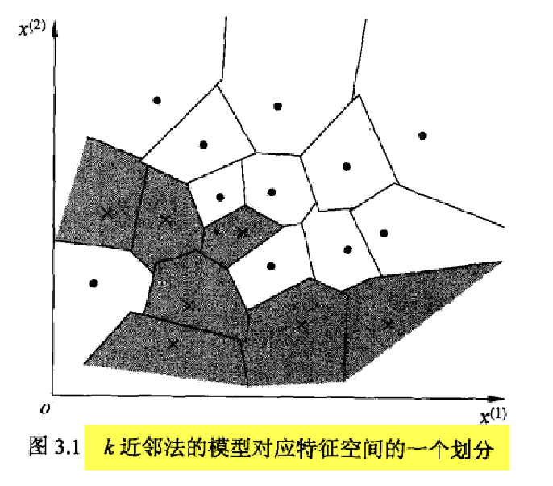
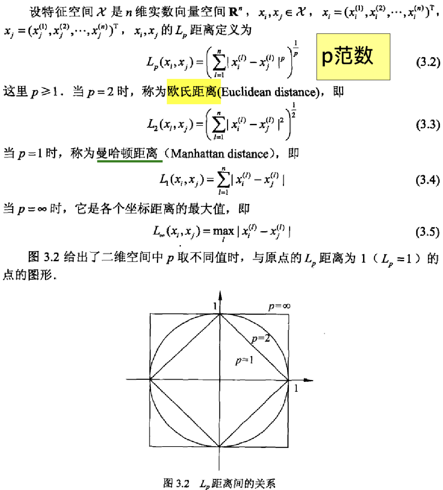

# 第3章 k邻近法-KNN

- 只讨论**分类问题**中的k邻近法

- 对新的实例，根据其k个最近的训练实例的类别，通过多数表决进行预测
  - 不具有显示的学习过程
- **三要素**
  - ==k值的选择==
  - 距离度量
  - 分类决策规则
- KNN与感知机
  - KNN不需要学参数去表示超平面
  - 感知机是一个线性模型，KNN不是

## 3.1 算法

## 3.2 模型

### 3.2.1 模型

- k近邻法的模型对应特征空间的一个划分
  - 分界面不是线性的
    - 比感知机的线性分界线要好一些，更准确一些

### 3.2.2 距离度量

==记住这张图==

### 3.2.3 k值的选择

- 学习一个k值
  - 依赖于测试数据的样本去做，看这个k值在测试集上面的表现
- **较小**的k值（容易过拟合，整体模型变**复杂**了）
  - **近似误差**会减小
  - **估计误差**会增大
    - 预测结果会对近邻点非常敏感
    - 如果这个点恰好是噪声，预测就会出错
- **较大**的k值（模型变得简单）
  - **估计误差**会减小
  - **近似误差**会增大
    - 比较远的样本也会影响预测
- 在应用中，k值一般取一个比较小的数值，通常采用交叉验证法来选取最优的k值

### 3.2.4 分类决策规则

就是投票