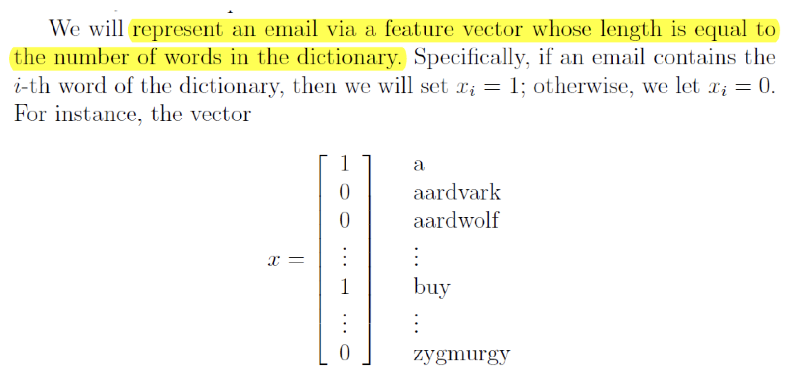
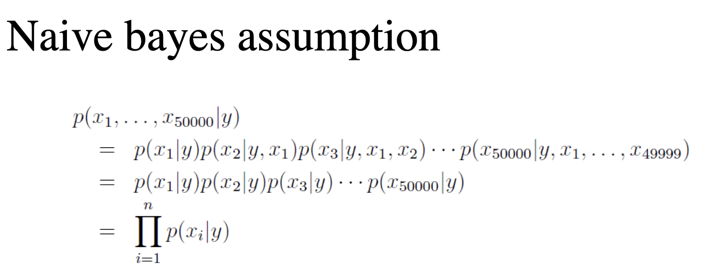
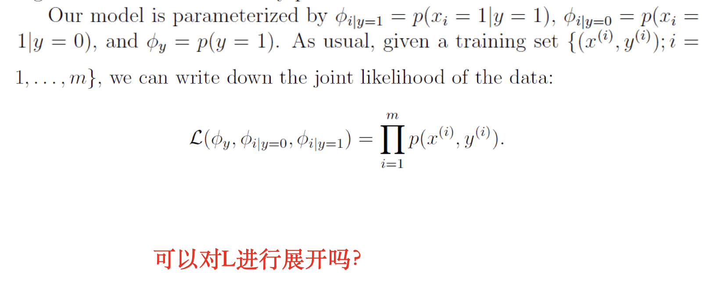
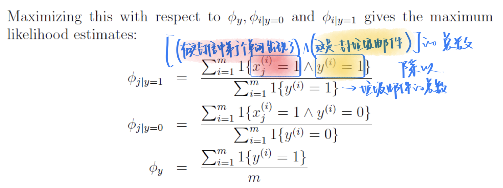
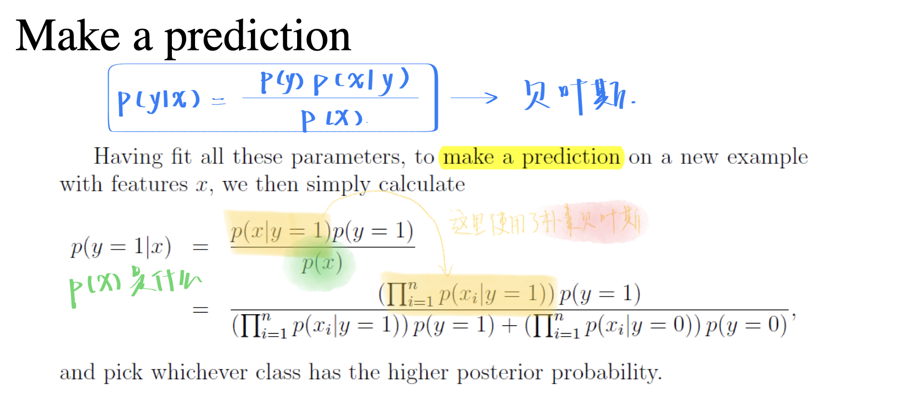
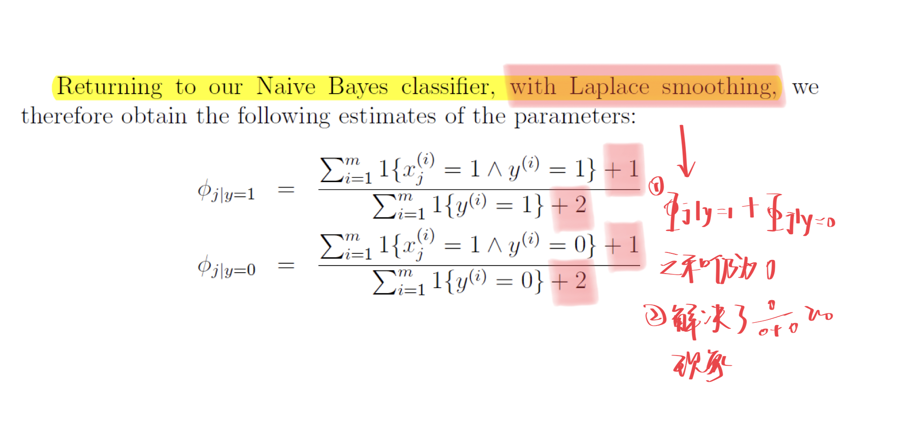

# 第4章 朴素贝叶斯法

> ## 如何进行邮件分类
>
> **关键：构建特征向量x**
>
> 1. 构建训练集
> 2. 用训练集学习一个学习器模型
> 3. 用模型预测结果
>
> ### **怎么去表示一个邮件**
>
> ~~一些敏感词的频数（但是怎么去统计哪些是敏感词呢）放在一个向量里面~~
>
> - 使用一个字典，邮件中出现了这个单词就是1，没有出现就是0；向量的长度与邮件的单词个数无关，之和字典中的单词数量有关。
>
> ~~发送方~~
>
> 
>
> 
>
> ### 挑战性
>
> 假设字典里面有50000个单词，那么这个$x$有$2^{50000}$种可能，要学习的参数的数量就是这个量级。
>
> **太大了**
>
> ### 解决方法
>
> 使用朴素贝叶斯：假设**各个特征之间相互独立**（这是一个很严苛的条件）也称为**NB假设**
> $$
> p(x_{2087}|y)=p(x_{2087}|y,x_{39831})
> $$
> 实际情况中不是相互独立的，但是最后发现做出来的模型效果很不错。
>
> 
>
> - **NB假设发生在第二步到第三步之间**
>
> ### 符号定义
>
> 
>
> $\phi_{i|y=1}$有50000个
>
> $\phi_{i|y=0}$有50000个
>
> $\phi_{y}$有1个，是先验概率，表示给一封信，判断它为垃圾邮件的概率为多少。
>
> **现在的数量是10001个。**
>
> 
> $$
> 1\{x\}
> $$
>
> - 当x为真的时候，表示的值为1
> - 当x为假的时候，表示的值为0
>
> 
>
> $p(x)$就是x出现的概率（在垃圾邮件中和非垃圾邮件中出现的总概率）
>
> ### 问题
>
> 出现了$\frac{0}{0+0}$的现象，当字典里面有一个单词既不在垃圾邮件中出现过（$\phi_{j|y=1}=p(x|y=1)=0$），也不在非垃圾邮件中出现过的时候（$\phi_{j|y=0}=p(x|y=0)=0$），就会出现这样的情况。
>
> ### 解决
>
> 

