# 第三章 语法分析

语法分析是编译过程的**核心部分**，其基本任务是根据**语言的语法规则**进行语法分析， 若不存在语法错误则给出正确的语法结构并**为语义分析和代码生成做准备**。

在描述程序语言的语法结构时，需借助于**上下文无关文法**。

而**文法**是描述**程序语言**的依据。

语法分析的**方法**通常分为两类，即自**顶向下分析方法**和**自底向上分析方法**。

## 3.1 文法和语言

| 名词   | 意思                   |
| ------ | ---------------------- |
| 自动机 | 程序语言的**识别系统** |
| 文法   | 程序语言的**生成系统** |
| 词法   | 用正规文法描述         |
| 语法   | 用上下文无关文法描述   |
| 语义   | 用上下文有关文法描述   |

- 正规表达式 = 正规文法

- 文法可以用来准确地描述一种语言
- 语言是$\sum ^{*}$的子集

### 3.1.1 文法和语言的基本概念

#### 1. 语言

设$\sum =\{a,b,c\}$，则$L = \{\epsilon,a,aa,ab,aaa,aab,aba,abb,...\}$为$\sum$上的一个语言。

#### 2. 文法

四元组
$$
G[S]=(V_{T},V_{N},S,\xi)
$$

| 符号    | 意思                                             | 名词         | 意思                                                         |
| ------- | ------------------------------------------------ | ------------ | ------------------------------------------------------------ |
| $V_{T}$ | 终结符号集，非空有限集，每个元素称为终结符号。   | 终结符号     | 语言不可再分的基本符号，代表了语法的最小单位，是一种个体记号 |
| $V_{N}$ | 非终结符号集，非空有限集，每个元素称为非终结符号 | 非终结符号   | 又称语法变量。代表一个一定的语法概念。                       |
| $S$     | 文法开始符，非终结符号                           | 文法开始符号 | ==一个特殊的非终结符，代表着语言的目标==                     |
| $\xi$   | 是产生式的非空有限集                             | 产生式       | 又称产生规则或规则。是定义语法实体的一种书写规则。<br />$\alpha \rightarrow \beta$<br /><br />$\alpha::=\beta$<br />读作“$\alpha 是 \beta$”或者“$\alpha 定义为 \beta$” |

> - 终结符号集合和非终结符号集合互不相交
>
> - 一个语法实体的相关规则可能不止一个
>
> - $\alpha$中至少有一个终结符号
>
> - $\beta \in (V_{T}并V_{N})^{*}$
>
> - 大写字母表示非终结符
>
> - 小写字母表示终结符
>
> - $\alpha , \beta, \gamma$表示字符串
>
> - 不能理解“语言的目标”

#### 3. 文法产生的语言

> $\Rightarrow$表示直接推导出，是应用产生规则进行推导的记号。
>
> - 箭头上面加一个*号，表示从$\alpha_{1}$出发，经过0步或若干步可推导出$\alpha_{n}$
> - 箭头上面加一个+号，表示从$\alpha_{1}$出发，经过一步或若干步可推导出$\alpha_{n}$

##### 推导

1️⃣最左推导

2️⃣最右推导（规范推导）

>  每一步的推导中，要用圆圈⭕️把非终结符圈住。

##### 句型、句子和语言

- 句型所表示的字符串中可以包括终结符或非终结符。语法树的所有叶子结点，自左至右派来起来的就是一个句型。
- 句子是仅包含终结符的句型
  - ==因此句子一定是句型，句型不一定是句子==
- 语言是句子的集合——$L(G)$

> 我的简单理解：
>
> - 句型：从S出发推导的第n步结果都是句型，$n \in [0,+\infin]$。显而易见S本身也是一个句型。
>
> - 句子：就S出发推导的第m步结果中全都是终结符的就是句子，$n \in [1,+\infin]$。就是能真真实实能理解这句话的才能叫句子呀。
>
> - 语言：语言就是句子的集合。很好理解了。

### 3.1.2 形式语言分类

...待补充

乔姆斯基把文法分成四种类型，即0型、1型、2型和3型，它们又分别称为短语文法、上下文有关文法、上下文无关文法和正规文法。

从0型文法到3型文法，逐渐增加限制。

#### 四类文法


#### 四类文法的关系与区别


> 
>
> 

### 3.1.3 正规表达式与上下文无关文法

1. 正规表达式到上下文无关文法的转换

正规表达式所描述的语言结构均可以用上下文无关文法描述，反之则不一定。

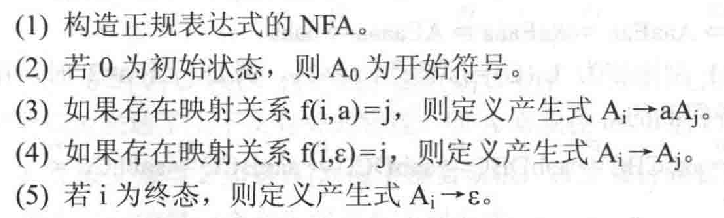

2. 正规表达式与上下文无关文法描述的对象

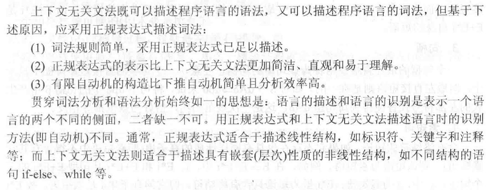

## 3.2 推导与语法树🌲

### 3.2.1 推导与短语

##### 1. 规范推导

- 最右推导（规范推导）：
  - 对句型中的最右非终结符用相应产生式的**右部**进行替换

# 不理解

- 最左推导

#### 2. 短语

短语属于句型的组成部分

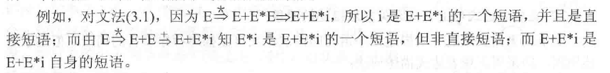

#### 3. 句柄

一个句型的最左直接短语

#### 4. 素短语

含有终结符的短语。

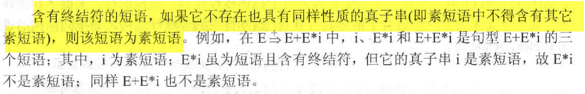


### 3.2.2 语法树与二义性

#### 1. 语法树

#### 2. 子树和短语

简单子树：只含有单层分枝的子树

1. 短语：**子树**的末端结点(即树叶)组成的符号串是相对于子树根的短语。
2. 直接短语：**简单子树**的末端结点组成的符号串是相对于简单子树根的直接短语。
3. 句柄：**==最左==简单子树**的末端结点组成的符号串为句柄。 
4. 素短语：**子树的末端结点**组成的符号串**含终结符**，且在该子树中不再有含有终结符的更小子树。

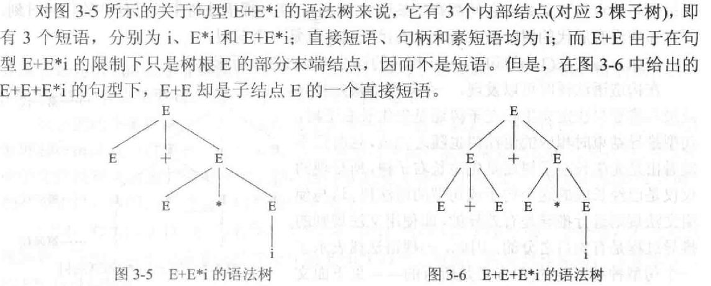

#### 3. 文法的二义性

文法的一个句子如果能找到两种不同的最左推导（最右推导），或者存在两棵不同的语法树，则称这个句子是**二义性**的。

一个文法如果包含二义性的句子，则这个文法是**二义文法**，否则是**无二义文法**


> 所有具备二义性的文法都不适合执行编译程序？
>
> 不是。

#### 4. 文法二义性的消除

一个文法是二义性，**不说明**其描述的语言也具有二义性。❓

要区分先天二义性和非先天二义性，非先天二义性是可以消除的。

**方法一**：不改变文法中原有的语法规则，仅加入一些语法的非形式规定。

**方法二**：构造一个**等价的**无二义性文法，即把**排除二义性的规则**合并到原有文法中，改写原有的文法


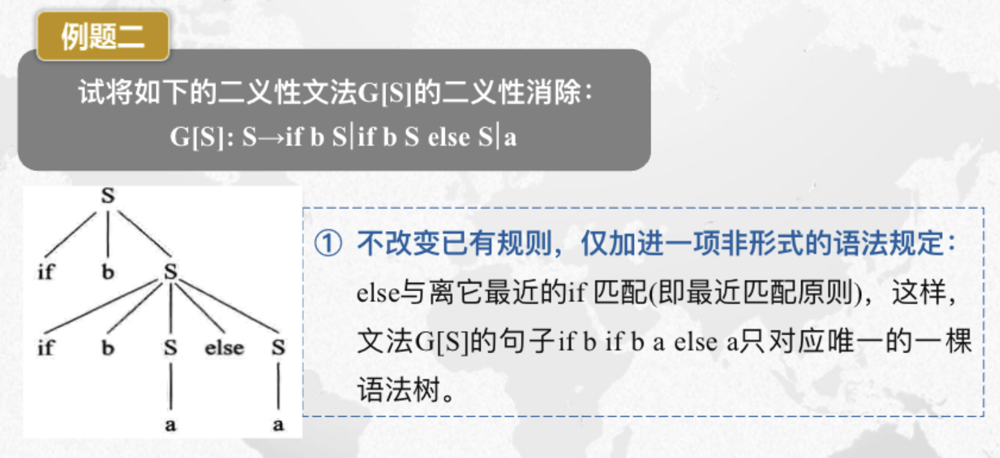

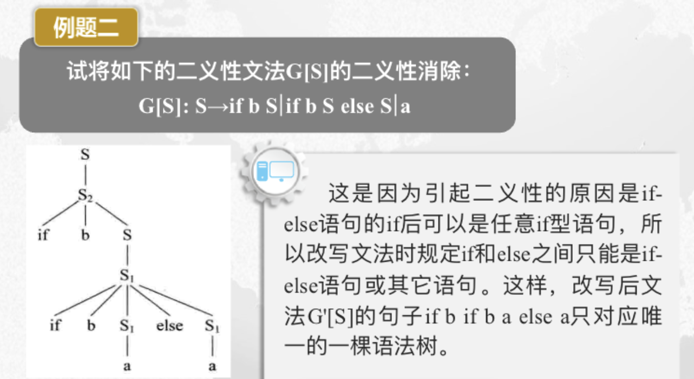

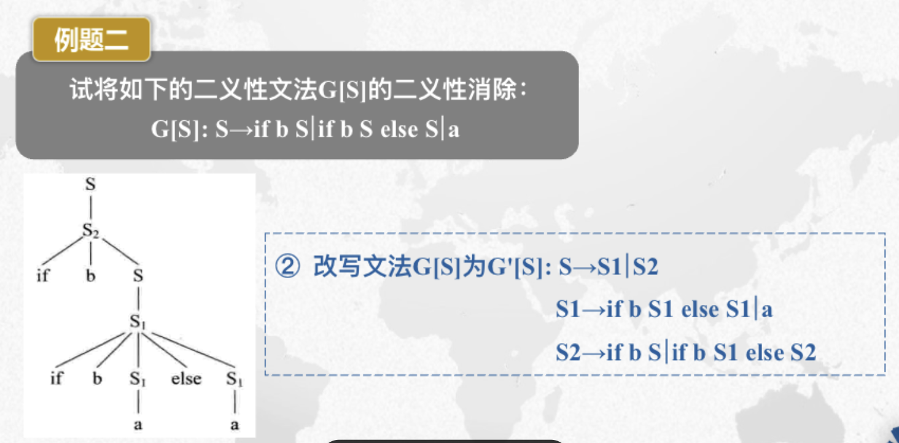

> ## 语法分析概述
>
> - 功能
>   - 根据文法规则，从源程序单词符号流中识别出语法成分，并进行语法检查
> - 基本任务
>   - 识别符号串S是否为某语法成分
> - 两大类分析方法
>   - （不带回溯的）自顶向下分析法
>     - 主要问题
>       - 左递归问题
>       - 回溯问题
>     - 主要方法
>       - 递归下降分析法
>       - LL(1)分析法
>   - 自底向上分析法
>     - 主要问题
>       - 可规约串的识别
>     - 主要方法
>       - 算符优先分析法 （“最左素短语”）
>       - LR分析法（“句柄”）
>

## 3.3 自顶向下的语法分析

- 从文法的开始符出发并寻找出这样 一个推导序列:推导出的句子恰为输入符号串 ;

- 或者说 ，能否从根结点出发向下长出一棵语法树，其叶结点组成的句子恰为输入符号串。

> 存在不确定性

### 3.3.1 递归下降分析法

递归下降方法是一种自顶向下的分析方法

#### 1. 自上而下分析存在不确定性

#### 2. 确定的自上而下分析

1. 文法不含左递归
2. 无回溯

#### ==3. 消除左递归==

引入一个新的非终结符，把含有左递归的产生式改为右递归。

1. 识别直接左递归形式

$$
A \rightarrow A \alpha | \beta
$$

2. 依据公式进行变换

$$
\begin{cases}
A \rightarrow \beta A'\\
A' \rightarrow \alpha A' | \varepsilon
\end{cases}
$$

扩展到多项：

1. 识别直接左递归形式

$$
A \rightarrow A \alpha_{1}|A \alpha_{2}|...|A \alpha_{m}| \beta_{1}|...| \beta_{n}
$$

2. 依据公式进行变换

$$
\begin{cases}
A \rightarrow \beta_{1} A'|\beta_{2} A'|...|\beta_{n} A'\\
A' \rightarrow \alpha_{1} A'|\alpha_{2} A'|...|\alpha_{m} A'   | \varepsilon
\end{cases}
$$

**消除间接左递归**

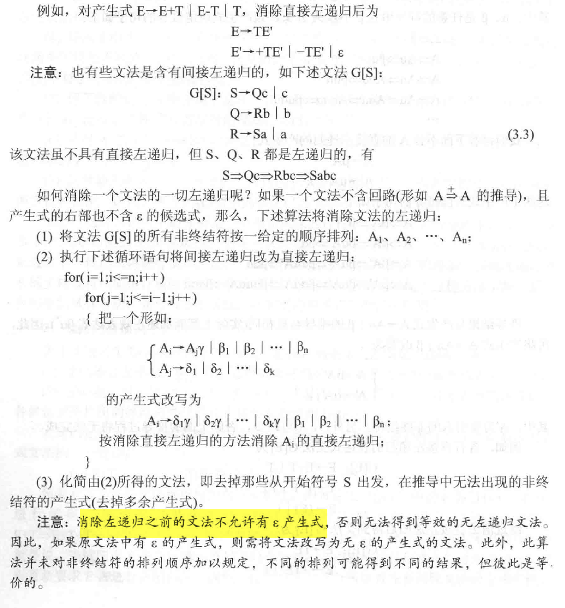

#### 4. 消除回溯

回溯发生的原因在于**候选式存在公共的左因子**

1. 识别

$$
A \rightarrow \delta \beta_{1}|\delta \beta_{2}|..|\delta \beta_{i}|\beta_{i+1}|..|\beta_{j}
$$

2. 改写(反复提取左因子)

$$
\begin{cases}
A \rightarrow \delta A'|\beta_{i+1}|...|\beta_{j}\\
A' \rightarrow \beta_{1}|...|\beta_{i}
\end{cases}
$$

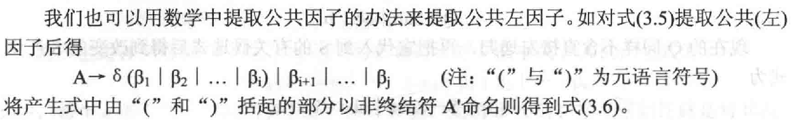

#### 5. 递归下降分析器

...待补充

### 3.3.2 LL(1)分析法

- 别名
  - 预测分析法

- 特点
  - 不带回溯的，无递归的方法
    - 必要时消除左递归和回溯


- 含义
  - 第一个L：从左到右扫描输入串
  - 第二个L：在分析过程中总是采用**最左推导**
  - 1:只需向右查看一个符号就可决定选择哪个产生式进行推导（所以也有**LL(k)**文法）
  
- 一个上下文无关文法是LL(1)文法的充分必要条件：
  - 对于每一个非终结符A的任何两个不同产生式$A \rightarrow \alpha | \beta$，都满足
    - 无回溯：A的每个候选式都不存在相同的首字符
    - 无二义性：在分析表的统一栏目中不出现$A \rightarrow \alpha$和$A \rightarrow \varepsilon$这种**多重入口**的情况
  

> 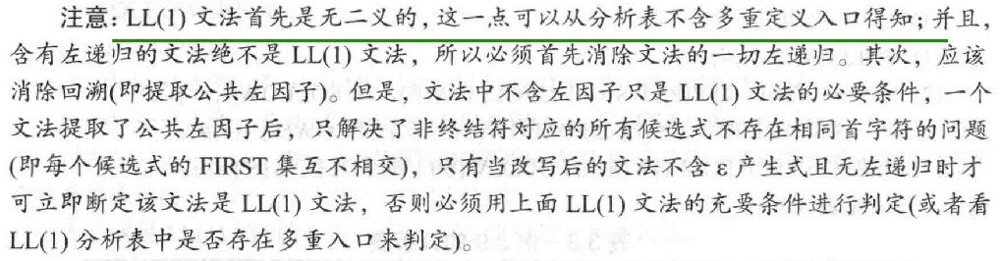

#### 1. 表驱动的LL(1)分析器

- LL(1)分析器的组成

  - 一张LL(1)分析表（预测分析表）
  - 一个先进后出的栈
  - 一个控制程序（表驱动程序）

- LL(1)分析器的说明

  - 输入串以"#"结尾
  - 分析栈的栈底是"#"；当分析栈中只剩下"#"，输入串指针也指向串尾的"#"时，分析成功
  - 分析表是一个矩阵M;分析表M[A,a]中的内容为一条关于A的产生式
  - 控制程序根据分析栈顶符号x和当前输入符号a来决定分析器的动作：

  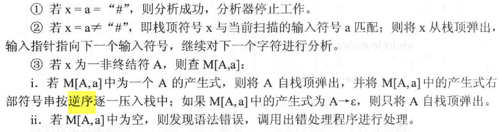

> 注意要**逆序**压入栈

#### 2. LL(1)分析表的构造


$FIRST(\alpha)$：$\alpha$的所有可能推导的**开头终结符**或可能的$\varepsilon$

$FOLLOW(A)$：是所有句型中出现在紧随A之后的**终结符**或"#"


**(1)FIRST集构造方法**

**(2)FOLLOW集构造方法**

1. 对文法开始符号S，置#于FLLOW(S)中
2. 若有$A \rightarrow \alpha B \beta$，则将$FIRST(\beta)/ \{\varepsilon\}$加入$FOLLOW(B)$中，此处的$\alpha$可以为空
3. 若$A \rightarrow \alpha B$或$A \rightarrow \alpha B \beta$，且$\beta$通过若干步可以推出$\varepsilon$,那么FOLLOW(A)=FOLLOW(B)。

> 构造 FIRST 集和FOLLOW 集的过程有可能要反复进行多次，直到每一个非终结符的FIRST 集和FOLLOW集都不再增大为止。

**(3)构造分析表M**


> 题目
>
> ```
> 递归下降分析器由一组递归函数组成，且每一个函数对应文法的(     )
> ```
>
> **A.一个非终结符**
>
> B.多个非终结符
>
> C.一个终结符
>
> D.多个终结符
>
> ```
> 递归下降分析法是一种（   ）的分析方法，文法的每个非终结符对应一个（   ）。
> ```
>
> A.自底向上，函数
>
> B.自顶向下，语法树
>
> C.自底向上，语法树
>
> **D.自顶向下，函数**
