# 第二章 词法分析


- 编译过程中每个阶段将源程序从一种表示转换成另一种表示
  - 词法分析是编译过程中的第一个阶段
    - 词法分析器的输入是**源代码**，输出是**单词符号**

- 词法分析的==难点==：识别单词符号的类别

## 2.1 编译程序词法分析器设计方法

### 1️⃣词法分析器

#### 定义

执行词法分析的程序。又称为==扫描器==

#### 任务

从左到右逐个字符地对源程序进行扫描，

产生一个个单词符号，

把**字符串形式的源程**序改造成为**单词符号串形式**的**中间程序**

### 其他人物

1. 删除注释行、空格、无用符号
2. 检查词法错误
3. 支持宏处理功能的语言由词法分析程序完成预处理

#### 处理结构

- 词法分析程序为主程序（结构清晰；效率低）
- 词法分析程序走位语法分析程序调用的子程序（效率高）

### 2️⃣单词符号的分类与输出形式

- 单词的定义==（选择题）==
  - 是**程序语言的基本语法单位**，具有确定的语法意义
  - 分为==五种==
    - 保留字
    - 标识符
    - 常数
    - 运算符
    - 界符（；、）

- 输出形式：二元式
  - 二元式：（单词种别，单词自身的值）
  - 通过查表可以得到输出
  - 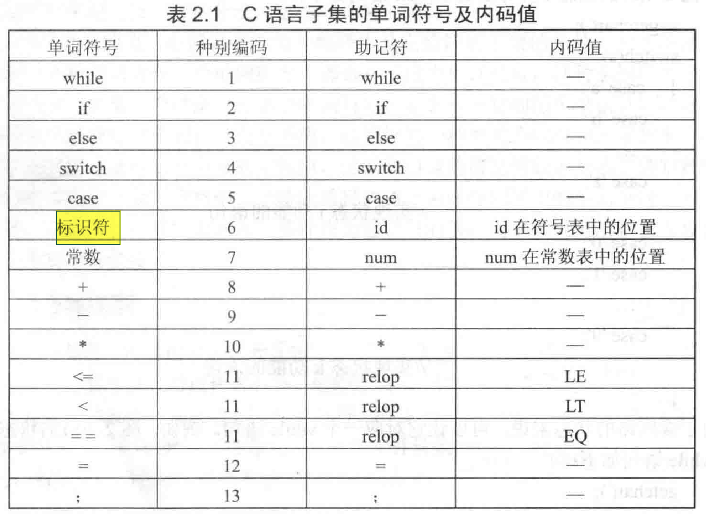
    - 表中标识符的单词种别是6，而标识符有很多，所以要通过单词自身的值去区分。（常数同理）
- 词法分析的==难点==：识别单词符号的类别

### 3️⃣状态转换图

#### 定义

有限的有向图，结点代表状态，用圆圈表示；

结点之间可由有向边连接，有向边可标记字符。

一张状态转换图有：

1. 有限个状态
1. 一个初态
1. 一个或多个终态，用双圈表示

> 双圆圈表示这是终止状态
>
> 双圆圈有一个上标*，表示要回退。即在识别单词的过程中==多读入了一个==其它不属于该单词的符号才进入终止状态。

#### 例子

1️⃣标识符：以字母开始的字母数字串

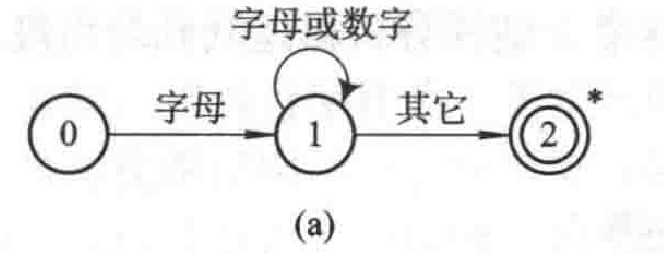

2️⃣$\{a^{n}|n >=1\}$

读入aaaaaaa....

3️⃣无符号整数

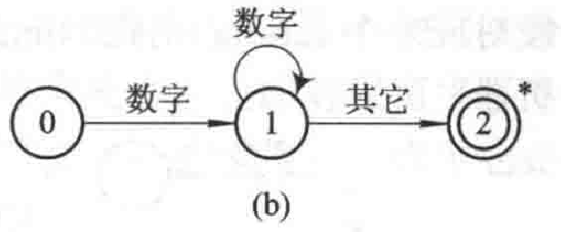

## 2.2 一个简单的词法分析器实例


## 2.3 正规表达式和有限自动机

> ==思考==：字符串由a和b组成，该字符串中的每个a都至少有一个b直接跟在其右边，如何构造其词法分析器？
>
> 很难手动地构造。
>
> 正规式：b\*(abb\*)*

所以：自动生成词法分析器，而不是手动地生成。

### 1️⃣正规表达式

正规式：表示单词符号的结构。一种形式化的表示法

正规集：正规式的集合

闭包：全集

|        符号        |                定义                |
| :----------------: | :--------------------------------: |
|    字母表$\sum$    |   字母表是有穷符号元素的非空集合   |
|        符号        |           字母表中的元素           |
|       符号串       | 字母表中的符号所组成的任意有穷序列 |
| 空字符串$\epsilon$ |        不含任何符号的符号串        |
|    $\sum ^{*}$     |      $\sum$上所有符号串的全体      |

| 单词符号 |       正规表达式       |
| :------: | :--------------------: |
|  标识符  | letter(letter\|digit)* |

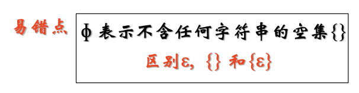

#### 符号串的计算

1. 连接

x和y的连接：xy

2. 幂运算

$x^{0}=\epsilon$

3. 符号串集合的连接

#### 正则表达式中的运算符

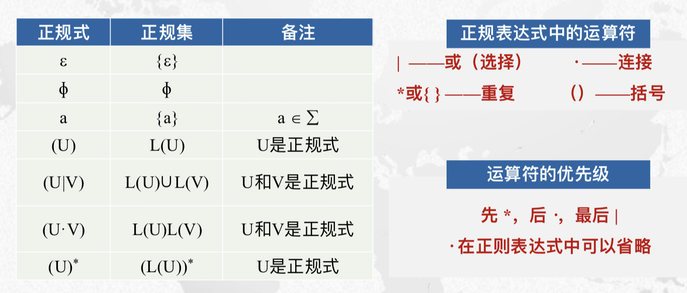

### 2️⃣正规表达式和正规集合的递归定义


### 3️⃣确定有限自动机DFA

==一对一、多对一==

==公式化==地表示状态转换图

- 输入字母表中不含有$\epsilon$
- 初态唯一
- 单值映射函数


### 4️⃣非确定有限自动机NFA

==一对多==

- 输入字母表中含有$\epsilon$
- 初始状态用一个集合来表示（初态不唯一）
- 多汁映射函数（输入同一个字符，有多条路）
- 状态矩阵中，用==集合==表示


> 判断输入字符串是否能被有限自动机接受？
>
> - 确定：当读取完所有字符，且到达有限自动机的终止状态，即可被接受
> - 非确定：只要找到一条满足的路即可（但是需要遍历，消耗大量时间）
>   - ==非确定都要变成确定==

## 2.4 正规表达式到有限 自动机的构造*（==重点和难点==） 

### 2.4.1 正规表达式-->NFA M

==正规表达式==通过==三条转换规则==变成非确定有限自动机NFA

- 三条转换规则
  - 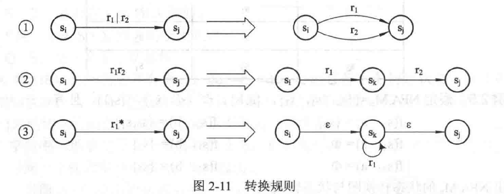

### 2.4.2 NFA M -->DFA M'

- 通过==子集法==变成确定有限自动机DFA

  - 写出转换表

  - | I                                                   | $I_{a}$                                                      | $I_{b}$       |
    | --------------------------------------------------- | ------------------------------------------------------------ | ------------- |
    | 写进所有的初始状态集合（包括X）                     | 由每个初始状态出发，记录走过的每个【$a,\epsilon ^{*}$,】路径中的节点，构成集合 | 和$I_{a}$同理 |
    | 把上一行中出现的新的状态，记录下来                  |                                                              |               |
    | ...                                                 |                                                              |               |
    | 所有这里包含的【包含原有的终态（Y）】的都看作为终态 |                                                              |               |

  - 根据转换表，为新的状态重新编码，写一个状态转换表

### 2.4.3 DFA M' --> DFA M''(化简)

- 通过==分割法==变成==最简==有限自动机
  - 先把S中是终态集和非终态集分为两个集合
  - 然后对于a中，如果是去往终态集和非终态集，则又再拆分为两个集合；如果不是就不用再分了
  - 然后对于b中，如果是去往终态集和非终态集，则又再拆分为两个集合；如果不是就不用再分了

> 逐层拆分。
>
> 总的来说，把去往终态集的都变成一个集合。
>
> 多个终态变成一个！


## 2.5 词法分析器的自动生成

1. 手工设计：正规式 --> NFA --> DFA -->最简DFA
2. 自动生成：借助正规式和LEX系统实现

## 作业

1. DFA与NFA有什么区别？

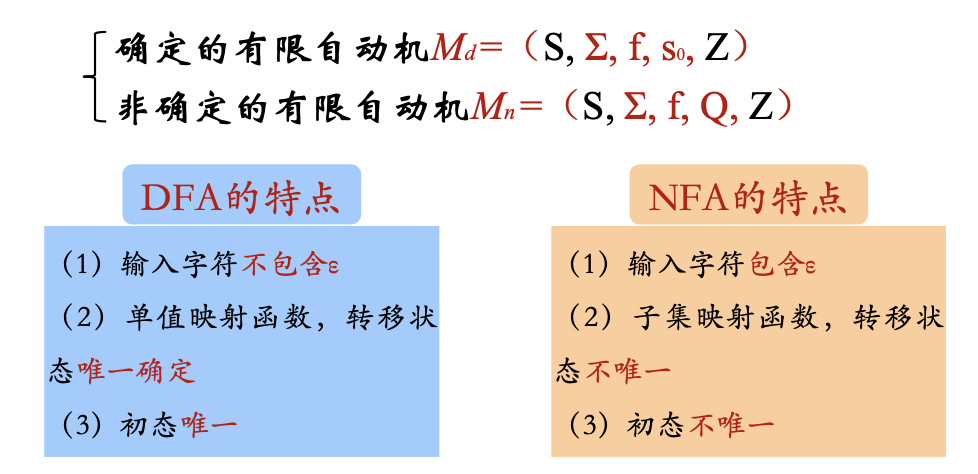

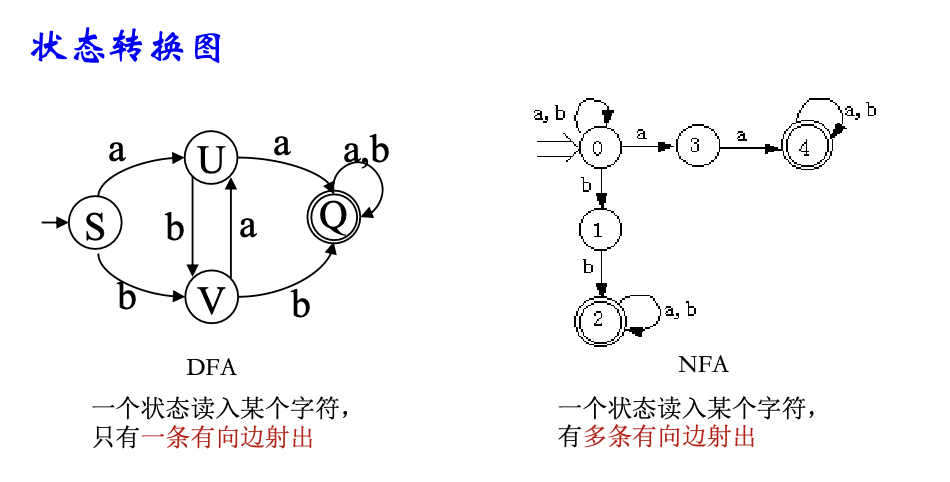

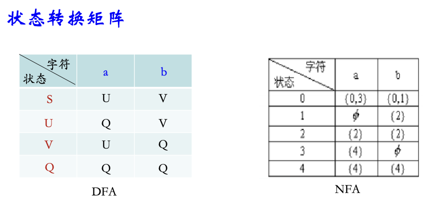

2. 含有$\epsilon$弧的有限自动机一定是NFA吗？

✅

> ### 原因：
>
> 1. **定义差异**：确定性有限自动机（DFA）要求每个状态在面对任意输入符号时，必须有且只有一个明确的转移。而非确定性有限自动机（NFA）允许在某个状态下针对同一输入符号有多个可能的转移，包括不消耗任何输入符号的转移（即 $\epsilon$-转移或空弧）。
> 2. **$\epsilon$-转移的特性**：
>    - **$\epsilon$-转移**（或空弧）指的是一种状态转移，它不依赖于任何输入符号。自动机可以从一个状态转移到另一个状态，而无需读取输入字符串中的任何字符。
>    - $\epsilon$-转移的存在引入了非确定性，因为从一个状态可以通过 $\epsilon$-弧转移到多个其他状态，而不消耗任何输入符号。这种特性违背了DFA的“确定性”要求。
> 3. **NFA的特点**：
>    - NFA允许**多条转移路径**，包括基于相同输入符号的不同转移和$\epsilon$-转移。
>    - 含有 $\epsilon$-弧的自动机，可以在不消耗输入的情况下，进入到多个不同的状态，表现出非确定性行为。

3. 如何判断两个自动机是否等价

> 判断两个自动机是否等价，通常指判断两个**确定性有限自动机**（DFA, Deterministic Finite Automaton）是否识别相同的语言。也就是说，给定的两个DFA A 和 B，需要判断它们是否对于每个输入字符串都做出相同的接受或拒绝决定。
>
> 常见的判断两个自动机是否等价的方法包括以下几种：
>
> ### 1. **最小化自动机后比较**
>
> - 步骤
>
>   1. 对两个DFA AAA 和 BBB 分别进行**最小化**，将它们转化为最小状态的DFA。
>   2. 检查最小化后的两个DFA是否等价（检查状态数和转换函数是否一致）。
>
>   - 如果最小化后的两个自动机是完全相同的（包括状态集合、转换函数、初态和终态），则它们是等价的。
>   - 如果最小化后不同，则它们不是等价的。
>
> ### 2. **构造对称差自动机**
>
> - 步骤
>
>   1. 构造两个DFA A 和 B 的**对称差自动机** $A \oplus B$，这个自动机识别语言$L(A) \oplus L(B) = (L(A) \setminus L(B)) \cup (L(B) \setminus L(A))$，即那些被一个自动机接受而另一个自动机拒绝的字符串。
>   2. 检查对称差自动机是否接受任何字符串。可以通过检查这个自动机是否存在从初始状态到终态的路径，即判断对称差自动机是否**可达**一个接受状态。
>
>   - 如果对称差自动机不可达任何接受状态，则两个DFA等价。
>   - 如果对称差自动机有一个接受状态可以被到达，则它们不等价。
>
> ### 3. **Hopcroft-Karp算法（状态等价性算法）**
>
> - 步骤
>   1. 使用**Hopcroft-Karp算法**（或类似的状态划分算法）将两个DFA的状态分组，以判断是否存在状态之间的等价关系。
>   2. 根据初始状态和等价状态的划分，判断两个自动机是否等价。
>
> ### 4. **通过语言区分字符串**
>
> - 步骤
>   1. 检查是否存在某个字符串 w，使得 A 接受w 而 BBB 不接受，或者反之。如果找到这样的字符串，说明 A 和 B 不等价。
>   2. 这可以通过遍历可能的输入字符串或通过某些启发式搜索来实现。
>
> ### 总结：
>
> 1. **最小化法**适合自动机不太复杂的情况，因为最小化自动机是直接而有效的方法。
> 2. **对称差法**通过构造新自动机，并判断是否存在可接受的字符串，这种方法较为通用且易于理解。
> 3. **状态等价性算法**是理论上最优的解决方法，在实际中可以处理更复杂的自动机等价问题。

两个有穷自动机 A1 和 A2，如果 L(A1) = L(A2)，则称自动机 A1 与 A2 等价。

https://www.cnblogs.com/lfri/p/11425266.html

4. 输入字母表为{0,1},它接受以0开头以1结束的所有序列，其正规式为选项（C），以及最简化的DFA（体现从正规式到最简DFA的计算过程）。

- 0\*1\*
- $0(0|1)^{+}1$
- 0(0|1)*1
- 0\*(0|1)*1\*

> *表示0个或多个

## 练习题1  词法分析器

1️⃣词法分析器的输入是（  ）。

- 源程序

```
2️⃣词法分析所依据的是（      ）。
等价变换规则
构词规则
语法规则
语义规则 
```

- 构词规则

> - 词法分析所遵循的是语言的==构词规则==
> - 语 法分析所遵循的是语言的==语法规则==
> - 把语法范畴翻译 成中间代码所遵循的是语言的==语义规则==
> - 优化所遵循的原则是程序的==等价变换规则==

```
词法分析器在处理源代码时，通常需要考虑哪些因素？
运行时环境
语法规则
词法规则
语义规则
```

- 词法规则

> **C. 词法规则**
>
> 词法分析器主要负责根据**词法规则**将源代码分解为一系列记号（Token）。它不关心运行时环境（A）、语法规则（B）、或语义规则（D），这些属于编译过程的其他阶段（如语法分析和语义分析）的任务。

## 练习题2 单词——程序语言的基本语法单位

词法分析器的任务是输入源程序，给出单词符号，一般包括单词的种别编码和自身的值。

- ✅

## 练习题3 **词法分析器输出单词的形式（二元式）**

```
下列关于单词符号分类不正确的是( )
“int PI;”这个语句中，“int” 是保留字类别。
“int PI;”这个语句中，“PI” 是浮点型常数类别。
一些常见语言标识符可以采用一符一类来方便编译程序的识别。
一般程序设计语言的单词符号可以分为五大类
```

- B
- C❓

> **B错误。**
>
> 在语句 `int PI;` 中，`PI` 是一个**整型变量**，而不是浮点型常数。根据该声明，`PI` 是用来存储整数值的，数据类型为 `int`。
>
> **C错误。**
>
> 常见语言中的标识符通常**不是一符一类**的。在编译过程中，标识符可能由多个字符组成，并且需要符合一定的命名规则。词法分析器会根据这些规则将标识符**识别为一个整体的记号**（Token），然后将其归类，例如变量名、函数名等。编译程序通过词法分析**将整个标识符识别为一个完整的实体**，而不是一符一类的方式。

## 练习题4 **状态转换图的用途**


已知状态图如图所示，下列哪些状态是多余状态。

- S2，S5，S6❌
- S1，S5，S6是多余状态
- S1，S2是等价状态

==不是很理解==

> 在状态转换图中，多余状态是指在状态机的操作过程中**无法到达或不影响最终输出**的状态。判断多余状态可以按照以下步骤进行：
>
> 1. **从初始状态出发，检查可达性**：
>    - 从初始状态开始，检查可以到达的所有状态。如果某个状态无法从初始状态通过任何路径到达，则该状态是多余的。
> 2. **检查状态对输出的贡献**：
>    - 如果一个状态即使可以从初始状态到达，但对最终的输出或目标没有影响（即从该状态无法达到任何终止状态或目标状态），那么这个状态也是多余的。
> 3. **确认不可互通的状态**：
>    - 如果一个状态从其他状态出发无法回到任何有效路径上，或者进入后就再也不能转移到其他状态，也可以视为多余。
>
> **总结**：多余状态通常表现为与主路径脱节，既不能被访问，也不会影响状态转换的结果或输出。您可以逐个分析状态的连通性来判断哪些状态是多余的。

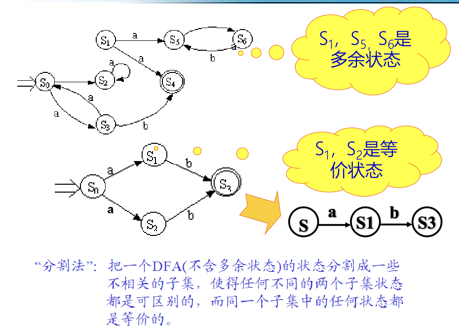

## 练习题6  状态转换图识别单词

\# 名词理解

```
1️⃣如果在状态转换图中，一个状态接收到特定字符后跳转到多个状态，这表示什么？
这是一个选择状态
这是一个结束状态
这是一个歧义状态
这是一个错误状态
```

- C❌

> Chatgpt：在状态转换图中，一个状态接收到特定字符后跳转到多个状态，通常表示 **C. 这是一个歧义状态**。这种情况说明在相同的输入下，系统的行为不明确，可能导致不确定性。
>
> 歧义状态和选择状态的区别在于它们的定义和作用：
>
> 1. **歧义状态**：
>    - 当一个状态接收到特定输入后，可以转移到多个不同的状态。这种情况导致了不确定性，因为在同样的输入下，系统可能会选择不同的路径。
>    - 这种状态在词法分析中通常是不允许的，因为它会导致解析的不确定性。
> 2. **选择状态**（也称为选择或分支状态）：
>    - 在这种状态下，系统可以根据不同的输入条件选择不同的转移路径。这是有意设计的，通常在一个状态中根据输入的不同来决定下一个状态。
>    - 选择状态是合法的，能够正确地处理多种可能的输入情况。
>
> 简而言之，歧义状态引入了不确定性，而选择状态则是对输入进行明确分类的有效机制。

- A✅

> **答案解析：**
>
> 在状态转换图中，如果一个状态接收到特定字符后可以跳转到多个状态，这表示这是一个选择状态，词法分析器需要根据后续的字符来决定跳转到哪个状态。

```
2️⃣在编写词法分析程序时，如何处理状态转换图中的回路？
将回路转换为循环结构
忽略回路
将回路转换为递归函数
将回路转换为条件判断
```

- A
- 不会

> 在编写词法分析程序时，状态转换图中的回路可以通过循环结构来处理，这样可以在程序中模拟状态之间的循环跳转。

```
3️⃣词法分析器能过滤源程序中的注释，但不能发现括号不匹配。
```

> ❌这个判断是 **错误的**。GPT说的。词法分析器的主要任务是对源程序进行词法分析，它可以过滤掉注释，同时也可以通过状态机的设计来检查括号是否匹配。因此，词法分析器不仅能过滤注释，还可以在一定程度上检测括号的匹配。通常，更复杂的语法检查会在语法分析阶段进行。
>
> ✅这个判断正确。答案说的。

\# 名词理解

```
4️⃣在状态转换图中，如果一个状态接收到一个字符后没有跳转到其他状态，这表示什么？
这是一个接受状态
这是一个死状态
这是一个开始状态
这是一个中间状态
```

- B

> 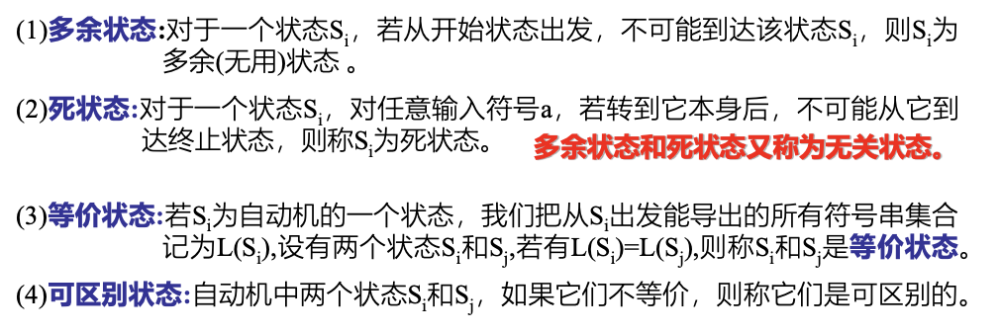

```
在状态转换图中，哪个状态通常用来表示词法分析的开始？
中间状态
死状态
开始状态
接受状态
```

- C

> **接受状态**是状态转换图中的一个特殊状态，表示输入字符串被成功识别或接受的状态。在词法分析中，当分析器到达接受状态时，意味着它成功地识别出一个有效的词法单元（token）。一旦达到接受状态，词法分析器通常会将已识别的部分输出，并准备处理下一个词法单元。

## 练习题7 符号串相关概念

\# **闭包**概念的理解

```
1️⃣给定字母表Σ={a, b}，下列哪个符号串是Σ*中的元素？
所有选项都是
ε
ab
aab
```

- A

> **书p17:**
>
> $R^{0}=\epsilon$ ，并 令 $R^{*}= R^{0} U R^{1}U R^{2}U R^{3}...$则 称$R^{*}$是 R 的 闭 包 ;
>
> 此 外 ，令$R^{+}=RR^{*}$， 并称$R^{+}$是$R $的正则闭包
>
> 闭包$R^{*}$ 中的每个字都是由$R$ 中的字经过有限次连接而生成的。

```
2️⃣已知集合U={11,22}，V={aa,bb,cc},集合U·V包含了若干字符串，下列哪些选项中的字符串都属于集合U·V的。 
11cc
22aa,22bb,22cc
1122,2211,aabb,bbcc
11aa，11bb
```

- 感觉除了C都属于

3️⃣判断题：**ℇ和ɸ都是给定字母表Σ上的正规式，它们表示的正规集分别为{ε}和ɸ。**

正确的！！！！！！！！！！！！！！！！！！


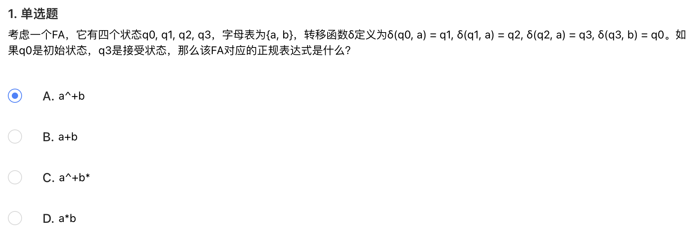

选了C

> **A. a\*b**
>
> - `a*` 表示可以有任意数量的 `a`，包括零个。
> - `b` 表示最后有一个 `b`。
> - **不正确**，因为至少需要 3 个 `a` 才能到达接受状态。
>
> **B. a^+b***
>
> - `a^+` 表示至少有一个 `a`。
> - `b*` 表示可以有零个或多个 `b`。
> - **正确**，因为这个表达式要求至少一个 `a`，符合 `a^+` 表示的模式，接着可以有任意多个 `b`。在这个自动机中，我们可以有 3 个 `a`（符合 `a^+`），然后可以有零个或多个 `b`（即 `b*`）。
>
> **C. a^+b**
>
> - `a^+` 表示至少一个 `a`。
> - `b` 表示最后必须有一个 `b`。
> - **不正确**，因为它要求最后有且只能有一个 `b`，而 `b*` 的情况更符合题意。
>
> **D. a+b**
>
> - `a+` 表示至少有一个 `a`。
> - `b` 表示最后有一个 `b`。
> - **不正确**，因为它要求最后有一个 `b`，这与自动机的行为不完全匹配。

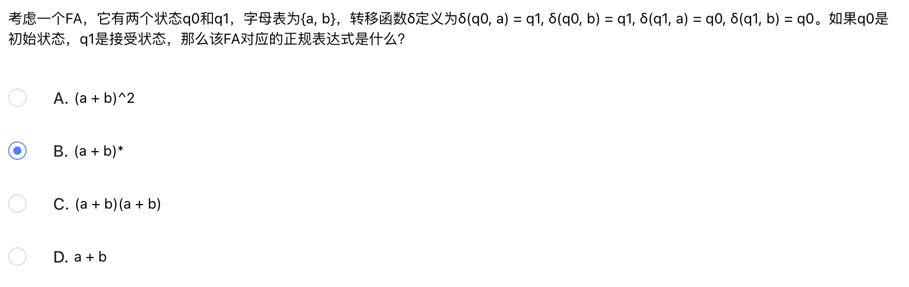

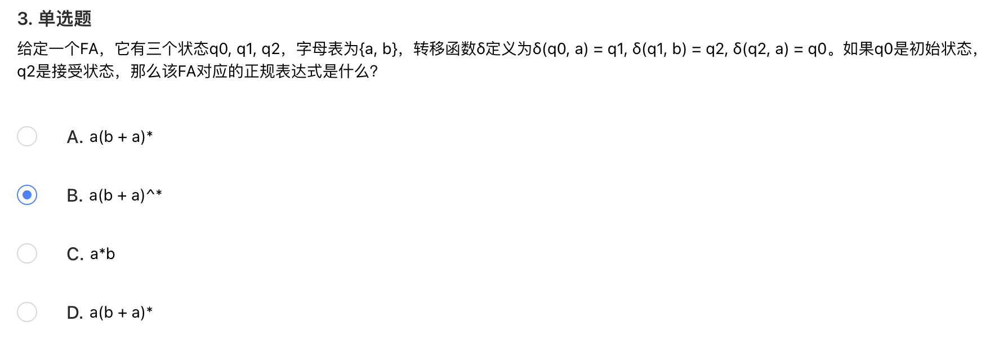


